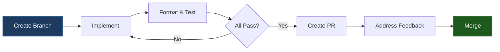
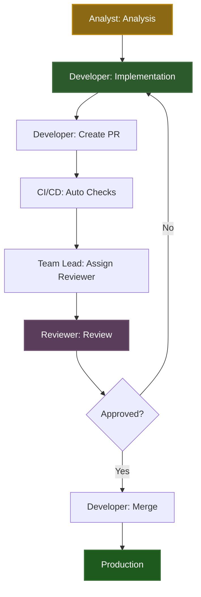

# Roles Guide

Quick reference for Analysts, Developers, and Reviewers.

## 👤 Analyst

**Role**: Analyze requirements, plan implementation, validate feasibility

### 🚀 Fully Automated Workflow (Zero Knowledge Required!)

**Just run one command:**

```bash
./scripts/analyst-workflow.sh
```

The script will:
- ✅ Ask you simple questions (hypothesis, type, scope)
- ✅ Setup project automatically
- ✅ Create branch with correct name
- ✅ Run all analysis commands
- ✅ Format and check code
- ✅ Commit with correct format
- ✅ Push branch
- ✅ Create PR automatically

**You don't need to know any commands!** Just answer questions. 🎉

### Manual Commands (if needed)

```bash
make setup          # Setup project
make info           # Project information
make analyze-full   # Check code quality baseline
make coverage       # View test coverage
make dependencies   # Check dependencies
```

### Workflow


### Deliverables

- Requirements document
- Technical analysis
- Architecture proposal
- Quality plan
- Test scenarios

**See**: [SDLC - Analysis Phase](development/SDLC.md#phase-0-hypothesis--analysis)

## 👨‍💻 Developer

**Role**: Implement features, write tests, maintain code quality

### Key Responsibilities

1. **Development**
   - Implement features/fixes
   - Write tests
   - Maintain code quality

2. **Pre-PR Validation**
   - Format code
   - Run quality checks
   - Verify tests pass

3. **PR Management**
   - Create PR with auto-generated description
   - Address review feedback
   - Merge approved PRs

### Essential Commands

```bash
# Development
make format         # Format code
make analyze-full   # Check quality
make test           # Run tests
make coverage       # Check coverage

# Pre-PR
make ci             # Full CI pipeline

# PR
./scripts/create-pr.sh  # Create PR
gh pr merge --squash    # Merge PR
```

### Workflow



### Branch Naming

Format: `<type>/<scope>-<description>`

Examples:
- `feat/service-add-payment`
- `fix/jmix-resolve-npe`
- `refactor/view-extract-logic`

**See**: [Branch Naming Rules](../.cursor/rules/branch-naming.mdc)

### Commit Format

Format: `<type>(<scope>): <description>`

Examples:
- `feat(service): add payment calculation`
- `fix(jmix): resolve null pointer`
- `refactor(view): extract form logic`

**See**: [Conventional Commits](../.cursor/rules/conventional-commits.mdc)

**See**: [SDLC - Development Phase](development/SDLC.md#phase-1-development-preparation)

## 👀 Reviewer

**Role**: Review code, ensure quality, approve PRs

### Key Responsibilities

1. **Code Review**
   - Verify code quality
   - Check Vibe Coding compliance
   - Validate implementation

2. **Quality Verification**
   - Verify CI/CD checks pass
   - Review SpotBugs findings
   - Check test coverage

3. **Approval**
   - Approve or request changes
   - Provide feedback
   - Guide improvements

### Essential Commands

```bash
# Review PR
gh pr checkout <number>  # Checkout PR locally
make analyze-full        # Verify quality
make test               # Run tests
make coverage           # Check coverage

# Review Actions
gh pr view <number>      # View PR
gh pr review <number>   # Review PR
```

### Review Checklist

- [ ] Code follows conventions
- [ ] No unnecessary suppressions
- [ ] Tests are comprehensive
- [ ] Coverage thresholds met
- [ ] CI/CD checks pass
- [ ] Documentation updated

**See**: [SDLC - Review Phase](development/SDLC.md#phase-4-code-review)

## 👔 Team Lead

**Role**: Manage PRs, assign reviewers, ensure quality

### Key Responsibilities

1. **PR Management**
   - Monitor PR queue
   - Assign reviewers
   - Facilitate reviews

2. **Quality Assurance**
   - Verify CI/CD passes
   - Review SonarCloud quality gate
   - Ensure standards maintained

3. **Decision Making**
   - Resolve conflicts
   - Make final decisions
   - Guide team

### Essential Commands

```bash
# PR Management
gh pr list              # List PRs
gh pr view <number>     # View PR
gh pr edit <number> --add-reviewer @username  # Assign reviewer
gh pr review <number>   # Review PR
```

### Reviewer Assignment

**Automatic**: CODEOWNERS file (`.github/CODEOWNERS`)
**Manual**: `gh pr edit <number> --add-reviewer @username`

**See**: [SDLC - Team Lead Responsibilities](development/SDLC.md#team-lead-responsibilities)

## 🔄 Complete Workflow



## 📚 Full Documentation

- [Quick Start Guide](QUICK_START.md) - Essential commands
- [SDLC Process](development/SDLC.md) - Complete workflow
- [Quality Gates](quality/QUALITY_GATES.md) - Quality standards
- [CI/CD Pipeline](ci-cd/CI_CD.md) - CI/CD details

