# Architecture

This document describes the system architecture, technology stack, and design patterns used in the Start project.

## Overview

Start is a Jmix-based enterprise application built with modern Java technologies, following Clean Architecture principles and Vibe Coding standards.

## C4 Model

This section uses the [C4 Model](https://c4model.com/) to describe the system architecture at different levels of abstraction.

### Level 1: System Context

The system context diagram shows the Start application in relation to its users and external systems.

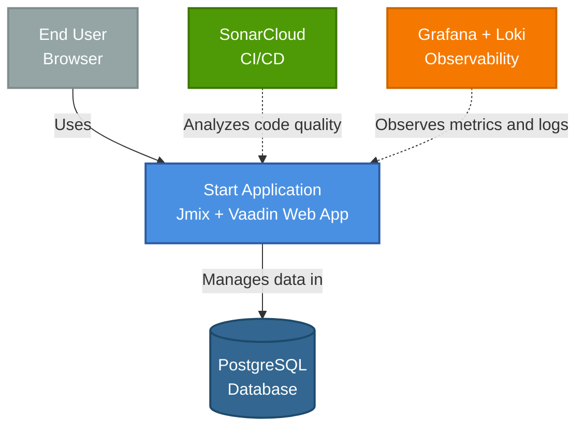

**Actors:**
- **End User**: Accesses the application via web browser
- **Developer**: Contributes code, uses CI/CD

**External Systems:**
- **PostgreSQL**: Primary data store
- **SonarCloud**: Code quality analysis (CI/CD)
- **Grafana + Loki**: Observability and monitoring

### Level 2: Container Diagram

The container diagram shows the high-level technical building blocks.

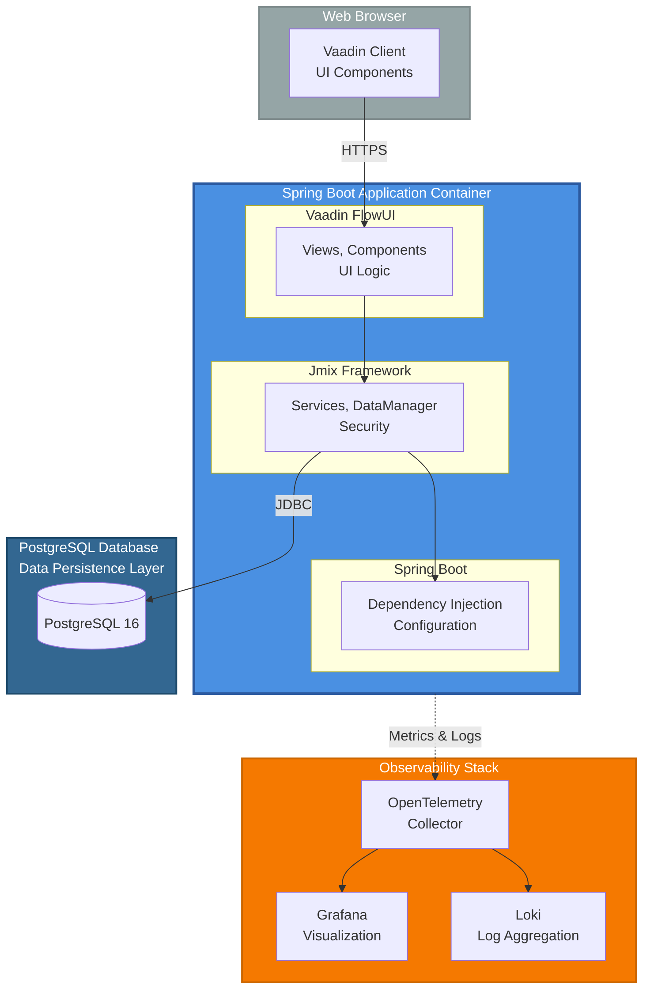

**Containers:**
1. **Web Browser**: Vaadin client-side components
2. **Spring Boot Application**: Main application container (JVM)
3. **PostgreSQL Database**: Data persistence
4. **Observability Stack**: Monitoring and logging

**Technologies:**
- **Frontend**: Vaadin FlowUI 24+
- **Backend**: Spring Boot 3.x, Jmix 2.7.1
- **Database**: PostgreSQL 16
- **Observability**: OpenTelemetry, Grafana, Loki

### Level 3: Component Diagram

The component diagram shows the detailed structure of all components within the Spring Boot application container.

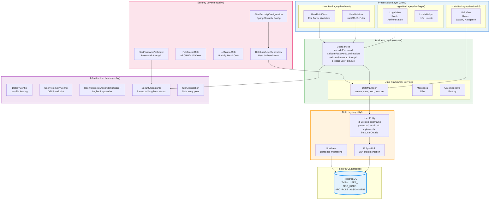

**Detailed Component Structure:**

**Presentation Layer (`view/`):**

1. **Login Package (`view/login/`)**:
   - `LoginView`: Authentication view
     - Route: `""` (root)
     - Handles user login
     - Uses `LoginViewSupport` for authentication
   - `LocaleHelper`: Internationalization helper
     - Locale management
     - Language switching

2. **Main Package (`view/main/`)**:
   - `MainView`: Main application layout
     - Route: `""` (after login)
     - Navigation menu
     - User menu with substitution indicator
     - Extends `StandardMainView`

3. **User Package (`view/user/`)**:
   - `UserListView`: User list management
     - CRUD operations
     - Filtering and sorting
     - Extends `StandardListView<User>`
   - `UserDetailView`: User detail/edit
     - Create/Edit form
     - Password validation
     - Extends `StandardDetailView<User>`

**Business Layer (`service/`):**

1. **UserService**:
   - `encodePassword(String)`: Encodes passwords using PasswordEncoder
   - `validatePasswordConfirmation(String, String)`: Validates password match
   - `validatePasswordStrength(String)`: Enforces minimum length
   - `prepareUserForSave(User, String, boolean)`: Prepares user for persistence
   - Dependencies: `PasswordEncoder`, `SecurityConstants`

**Data Layer (`entity/`):**

1. **User Entity**:
   - Primary key: `id` (UUID, `@JmixGeneratedValue`)
   - Version: `version` (Integer, `@Version` for optimistic locking)
   - Fields: `username`, `password` (`@Secret`), `firstName`, `lastName`, `email`, `active`, `timeZoneId`
   - Implements: `JmixUserDetails`, `HasTimeZone`
   - Table: `USER_` with unique index on `username`

**Security Layer (`security/`):**

1. **StartSecurityConfiguration**:
   - Spring Security configuration
   - Password encoder bean (BCrypt)
   - Authentication provider setup

2. **DatabaseUserRepository**:
   - Extends `AbstractDatabaseUserRepository<User>`
   - User authentication and lookup
   - Authority management
   - System user initialization

3. **Roles**:
   - `FullAccessRole`: Full system access
     - All entity CRUD operations
     - All views access
     - All menu items
   - `UiMinimalRole`: UI-only access
     - Read-only access
     - Limited views

4. **StartPasswordValidator**:
   - Password strength validation
   - Minimum length enforcement

**Infrastructure Layer (`config/`):**

1. **DotenvConfig**:
   - Loads `.env` file for local development
   - Environment variable management

2. **OpenTelemetryConfig**:
   - OpenTelemetry SDK configuration
   - OTLP endpoint setup
   - Metrics and tracing export

3. **OpenTelemetryAppenderInitializer**:
   - Logback appender initialization
   - Log export to OpenTelemetry

4. **SecurityConstants**:
   - Security-related constants
   - Password length requirements
   - Utility methods

5. **StartApplication**:
   - Main Spring Boot application class
   - DataSource configuration
   - Application startup event handling

### Component Interactions

**User Authentication Flow:**

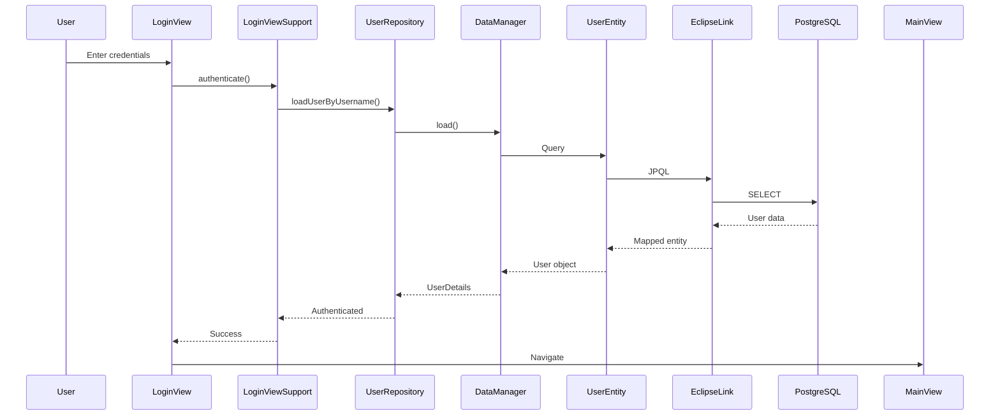

**User Creation Flow:**

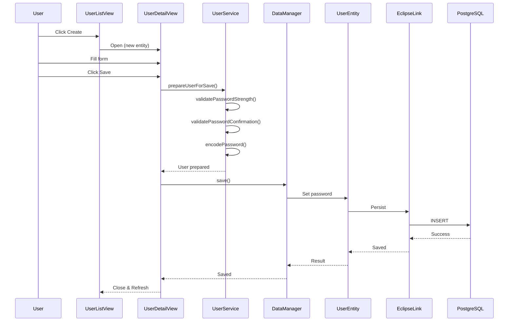

**User Update Flow:**

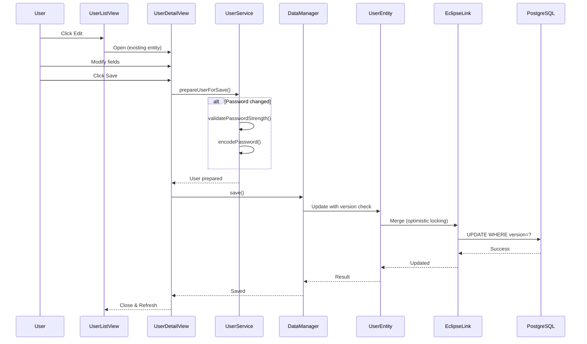

**User List Flow:**

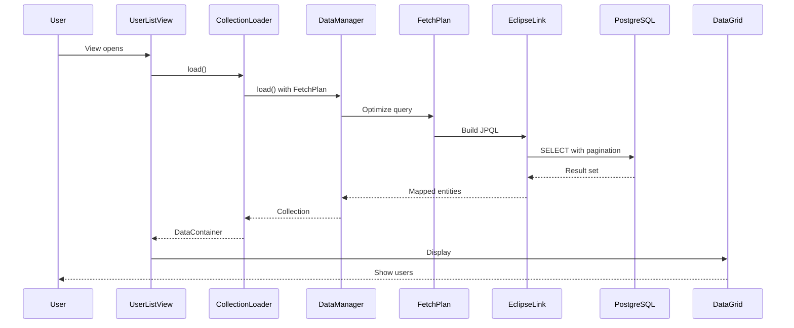

**Security Check Flow:**

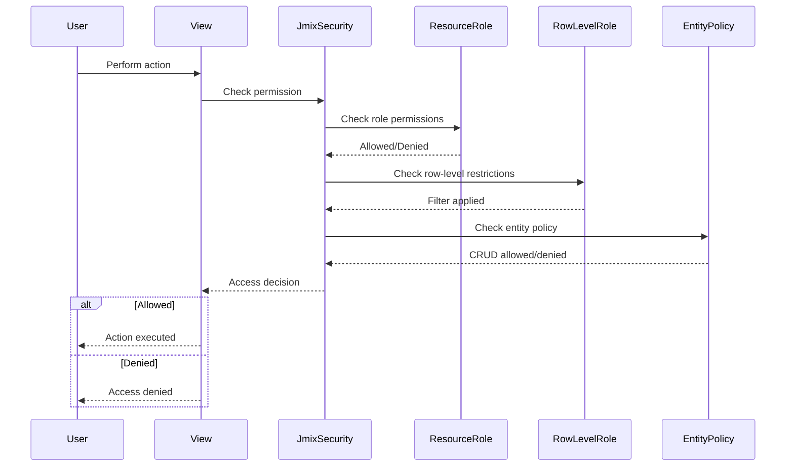

### Package Structure

```
com.digtp.start/
├── annotation/          # Custom annotations
├── config/              # Configuration classes
│   ├── DotenvConfig.java
│   ├── OpenTelemetryConfig.java
│   ├── OpenTelemetryAppenderInitializer.java
│   └── SecurityConstants.java
├── entity/              # JPA entities
│   └── User.java
├── security/            # Security configuration
│   ├── StartSecurityConfiguration.java
│   ├── DatabaseUserRepository.java
│   ├── FullAccessRole.java
│   ├── UiMinimalRole.java
│   └── StartPasswordValidator.java
├── service/             # Business logic
│   └── UserService.java
├── view/                # UI views
│   ├── login/
│   │   ├── LoginView.java
│   │   └── LocaleHelper.java
│   ├── main/
│   │   └── MainView.java
│   └── user/
│       ├── UserListView.java
│       └── UserDetailView.java
└── StartApplication.java # Main application class
```

### Component Dependencies

**View Dependencies:**
- Views depend on Services (business logic)
- Views use Jmix framework services (Messages, UiComponents, DataManager)
- Views do NOT depend on entities directly (use DataManager)

**Service Dependencies:**
- Services depend on DataManager (data access)
- Services depend on framework services (PasswordEncoder, etc.)
- Services do NOT depend on Views

**Entity Dependencies:**
- Entities are independent (domain models)
- No dependencies on other application layers

**Security Dependencies:**
- Security configuration depends on Spring Security
- User repository depends on DataManager
- Roles are interfaces (no dependencies)

### Data Flow Details

**Read Operation:**

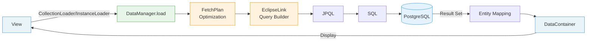

**Write Operation:**

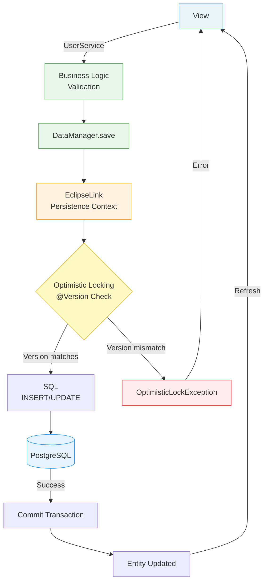

**Data Flow:**
```
View → Service → DataManager → Entity → EclipseLink → PostgreSQL
```

### Technology Mapping

| C4 Component | Technology | Documentation |
|--------------|------------|---------------|
| Presentation Layer | Vaadin FlowUI 24+ | [Vaadin Docs](https://vaadin.com/docs) |
| Business Layer | Jmix 2.7.1 | [Jmix Docs](https://docs.jmix.io/jmix/) |
| Data Layer | EclipseLink, Liquibase | [EclipseLink](https://www.eclipse.org/eclipselink/documentation/), [Liquibase](https://docs.liquibase.com/) |
| Infrastructure | Spring Boot 3.x | [Spring Boot](https://docs.spring.io/spring-boot/docs/current/reference/html/) |
| Database | PostgreSQL 16 | [PostgreSQL](https://www.postgresql.org/docs/) |

### Deployment Context

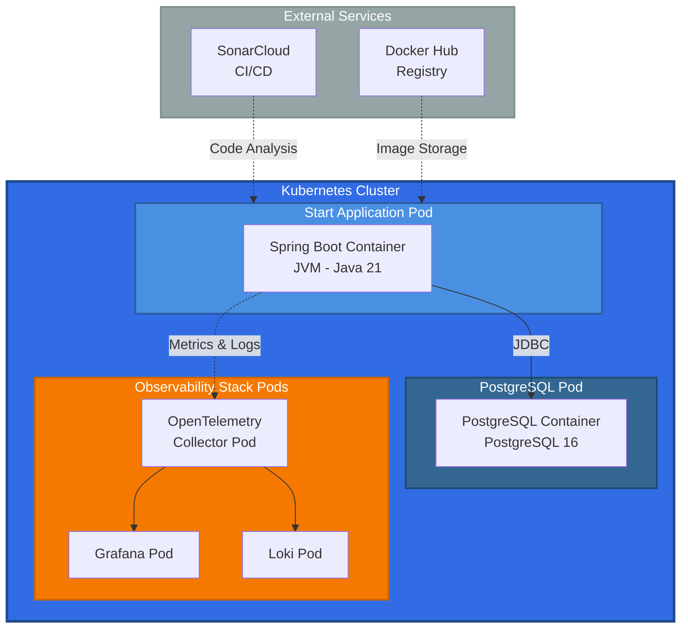

**Deployment Options:**
- **Docker**: Single container with PostgreSQL external
- **Kubernetes**: Pods for application and database
- **Helm**: Package manager for Kubernetes deployment

**References:**
- [C4 Model](https://c4model.com/) - Architecture diagramming methodology
- [Structurizr](https://structurizr.com/) - C4 model tooling

## Technology Stack

### Core Framework

| Technology | Version | Purpose | Documentation |
|------------|---------|---------|---------------|
| **Java** | 21 | Programming language | [Java 21 Docs](https://docs.oracle.com/en/java/javase/21/) |
| **Jmix** | 2.7.1 | Application framework | [Jmix Documentation](https://docs.jmix.io/jmix/) |
| **Vaadin** | 24+ | Web UI framework | [Vaadin Docs](https://vaadin.com/docs) |
| **Spring Boot** | 3.x | Application framework | [Spring Boot Reference](https://docs.spring.io/spring-boot/docs/current/reference/html/) |

### Data Layer

| Technology | Version | Purpose | Documentation |
|------------|---------|---------|---------------|
| **PostgreSQL** | 16 | Relational database | [PostgreSQL Docs](https://www.postgresql.org/docs/) |
| **Liquibase** | Latest | Database migration tool | [Liquibase Docs](https://docs.liquibase.com/) |
| **EclipseLink** | Latest | JPA implementation | [EclipseLink Docs](https://www.eclipse.org/eclipselink/documentation/) |
| **HikariCP** | Latest | Connection pooling | [HikariCP GitHub](https://github.com/brettwooldridge/HikariCP) |

### Build & Quality

| Technology | Version | Purpose | Documentation |
|------------|---------|---------|---------------|
| **Gradle** | 8.12.x | Build tool | [Gradle User Guide](https://docs.gradle.org/8.12/userguide/userguide.html) |
| **Palantir Baseline** | 6.76.0 | Code quality tools | [Baseline GitHub](https://github.com/palantir/gradle-baseline) |
| **Checkstyle** | Baseline | Code style | [Checkstyle](https://checkstyle.sourceforge.io/) |
| **PMD** | 7.9.0 | Static analysis | [PMD](https://pmd.github.io/) |
| **SpotBugs** | 6.4.7 | Bug detection | [SpotBugs](https://spotbugs.github.io/) |
| **SonarLint/SonarCloud** | Latest | Code quality | [SonarLint](https://www.sonarsource.com/products/sonarlint/), [SonarCloud](https://docs.sonarcloud.io/) |
| **Error-prone** | 2.36.0 | Compile-time checks | [Error Prone](https://errorprone.info/) |
| **JaCoCo** | 0.8.13 | Code coverage | [JaCoCo](https://www.jacoco.org/jacoco/) |
| **Spotless** | 8.1.0 | Code formatting | [Spotless](https://github.com/diffplug/spotless) |

### Observability

| Technology | Version | Purpose | Documentation |
|------------|---------|---------|---------------|
| **OpenTelemetry** | 1.56.0 | Observability framework | [OpenTelemetry Docs](https://opentelemetry.io/docs/) |
| **Grafana** | Latest | Metrics and visualization | [Grafana Docs](https://grafana.com/docs/) |
| **Loki** | Latest | Log aggregation | [Loki Docs](https://grafana.com/docs/loki/latest/) |

### Deployment

| Technology | Version | Purpose | Documentation |
|------------|---------|---------|---------------|
| **Docker** | Latest | Containerization | [Docker Docs](https://docs.docker.com/) |
| **Kubernetes** | Latest | Orchestration | [Kubernetes Docs](https://kubernetes.io/docs/) |
| **Helm** | Latest | Package manager | [Helm Docs](https://helm.sh/docs/) |

## Project Structure

```
src/
├── main/
│   ├── java/com/digtp/start/
│   │   ├── annotation/          # Custom annotations
│   │   ├── config/              # Configuration classes
│   │   │   ├── DotenvConfig.java
│   │   │   ├── OpenTelemetryConfig.java
│   │   │   └── SecurityConstants.java
│   │   ├── entity/              # JPA entities
│   │   │   └── User.java
│   │   ├── security/            # Security configuration
│   │   │   ├── StartSecurityConfiguration.java
│   │   │   ├── FullAccessRole.java
│   │   │   └── UiMinimalRole.java
│   │   ├── service/             # Business logic
│   │   │   └── UserService.java
│   │   ├── view/                # Vaadin views
│   │   │   ├── login/
│   │   │   ├── main/
│   │   │   └── user/
│   │   └── StartApplication.java
│   ├── resources/
│   │   ├── application.properties
│   │   ├── com/digtp/start/
│   │   │   ├── liquibase/       # Database migrations
│   │   │   ├── menu.xml         # Navigation menu
│   │   │   └── messages_*.properties  # i18n
│   │   └── logback-spring.xml
│   └── frontend/
│       └── themes/start/        # Vaadin theme
└── test/
    ├── java/com/digtp/start/
    │   ├── architecture/        # Architecture tests
    │   └── ...                  # Unit and integration tests
    └── resources/
        └── application-test.properties
```

## Layer Architecture

### Entity Layer (`entity/`)

- **Purpose**: Domain models and JPA entities
- **Patterns**: 
  - `@JmixEntity` for Jmix metadata
  - `@Entity` for JPA mapping
  - `@Version` for optimistic locking
  - Lombok for boilerplate reduction
- **Rules**: 
  - Use `dataManager.create()` instead of `new Entity()`
  - Entities must be in `entity/` package
  - Use UUID for primary keys

**Example:**
```java
@JmixEntity
@Entity
@Table(name = "USER_")
@Getter
@Setter
public class User implements JmixUserDetails {
    @Id
    @JmixGeneratedValue
    private UUID id;
    
    @Version
    private Integer version;
    
    // ...
}
```

### Service Layer (`service/`)

- **Purpose**: Business logic and transactions
- **Patterns**:
  - `@Service` annotation
  - Constructor injection
  - `@Transactional` for database operations
- **Rules**:
  - Services must not access views directly
  - Use `DataManager` for data operations
  - Validate input parameters

**Example:**
```java
@Service
@RequiredArgsConstructor
public class UserService {
    private final DataManager dataManager;
    
    @Transactional
    public User createUser(String username) {
        // Business logic
    }
}
```

### View Layer (`view/`)

- **Purpose**: UI components and user interaction
- **Patterns**:
  - Extend `StandardListView<T>` or `StandardDetailView<T>`
  - Use `@ViewComponent` for UI injection
  - XML descriptors for layout
- **Rules**:
  - Views must not access repositories directly
  - Use services for business logic
  - Follow Vaadin best practices

**Example:**
```java
@Route("users")
@ViewController("UserListView")
@ViewDescriptor("user-list-view.xml")
@RequiredArgsConstructor
public class UserListView extends StandardListView<User> {
    private final UserService userService;
    // ...
}
```

### Security Layer (`security/`)

- **Purpose**: Authentication and authorization
- **Patterns**:
  - `@ResourceRole` for resource permissions
  - `@RowLevelRole` for row-level security
  - `@EntityPolicy` for entity policies
- **Rules**:
  - Use Jmix security annotations
  - Implement custom roles as needed
  - Follow principle of least privilege

### Configuration Layer (`config/`)

- **Purpose**: Application configuration
- **Patterns**:
  - `@Configuration` classes
  - `@Bean` methods
  - Environment-based configuration
- **Rules**:
  - Use `@Value` for property injection
  - Avoid `System.getenv()` directly
  - Use `.env` file for local development

## Design Patterns

### Clean Architecture

The project follows Clean Architecture principles:

- **Dependency Rule**: Inner layers don't depend on outer layers
- **Separation of Concerns**: Clear boundaries between layers
- **Dependency Injection**: Constructor injection throughout

### SOLID Principles

- **Single Responsibility**: Each class has one reason to change
- **Open/Closed**: Open for extension, closed for modification
- **Liskov Substitution**: Subtypes must be substitutable
- **Interface Segregation**: Many specific interfaces
- **Dependency Inversion**: Depend on abstractions

### Framework Patterns

- **Jmix Patterns**: Standard views, data managers, security roles
- **Vaadin Patterns**: View lifecycle, component injection
- **Spring Patterns**: Configuration, dependency injection, transactions

## Database Schema

### Migration Management

- **Tool**: Liquibase
- **Location**: `src/main/resources/com/digtp/start/liquibase/`
- **Naming**: `V{version}__{description}.xml`
- **Rules**: Never modify applied migrations

### Schema Design

- **Naming**: UPPER_SNAKE_CASE for tables and columns
- **Indexes**: Created for foreign keys and frequently queried columns
- **Constraints**: Unique constraints, foreign keys, check constraints
- **Versioning**: `@Version` for optimistic locking

## Security Architecture

### Authentication

- **Provider**: Jmix Security
- **Storage**: Database (`User` entity)
- **Password**: Encrypted with `PasswordEncoder`

### Authorization

- **Resource Roles**: Permission-based access control
- **Row-Level Roles**: Data-level security
- **Entity Policies**: CRUD permissions

### Security Configuration

- **File**: `StartSecurityConfiguration.java`
- **Roles**: `FullAccessRole`, `UiMinimalRole`
- **Policies**: Defined in security configuration

## Observability

### Logging

- **Framework**: Logback
- **Format**: Structured logging
- **Levels**: DEBUG, INFO, WARN, ERROR
- **Appenders**: Console, File, OpenTelemetry

### Metrics

- **Framework**: OpenTelemetry
- **Export**: OTLP endpoint
- **Visualization**: Grafana

### Tracing

- **Framework**: OpenTelemetry
- **Storage**: Loki (via OpenTelemetry Collector)
- **Query**: Grafana Explore

## Deployment Architecture

### Docker

- **Base Image**: `eclipse-temurin:21-jre-alpine`
- **Multi-stage Build**: Optimized for size
- **Health Checks**: Spring Boot Actuator

### Kubernetes

- **Deployment**: Stateless application
- **Service**: ClusterIP for internal access
- **Ingress**: External access (optional)
- **ConfigMap**: Application configuration
- **Secrets**: Sensitive data

### Helm

- **Chart**: `helm/start/`
- **Values**: Configurable via `values.yaml`
- **Templates**: Kubernetes manifests

## Data Flow

The data flow follows this path:

**User Request → Vaadin View (UI Layer) → Service Layer (Business Logic) → DataManager (Data Access) → Entity Layer (Domain Model) → Database (PostgreSQL)**

## Configuration Management

### Environment Variables

- **Local**: `.env` file (not committed)
- **Docker**: Environment variables
- **Kubernetes**: ConfigMap and Secrets

### Profiles

- **default**: Local development
- **docker**: Docker Compose
- **kubernetes**: Kubernetes deployment
- **prod**: Production optimizations

## References

- [Jmix Documentation](https://docs.jmix.io/jmix/)
- [Vaadin Documentation](https://vaadin.com/docs)
- [Spring Boot Reference](https://docs.spring.io/spring-boot/docs/current/reference/html/)
- [Clean Architecture](https://blog.cleancoder.com/uncle-bob/2012/08/13/the-clean-architecture.html)
- [SOLID Principles](https://en.wikipedia.org/wiki/SOLID)

