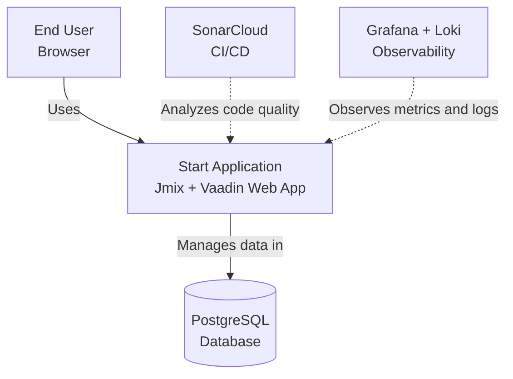
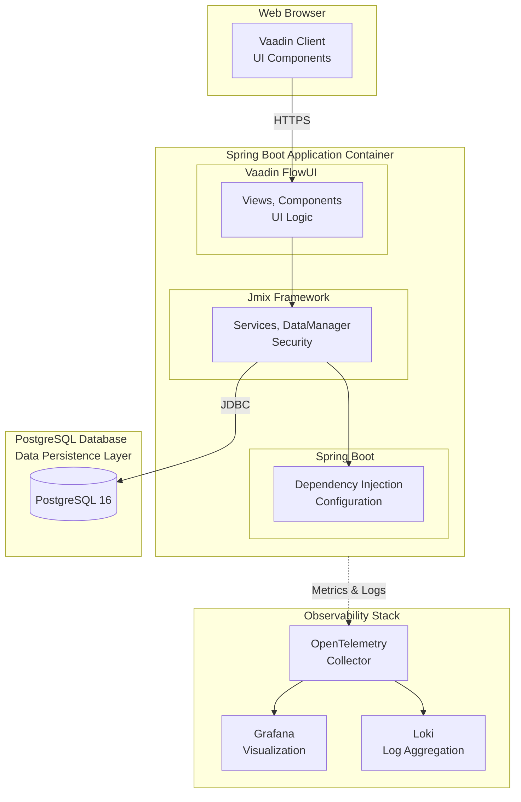
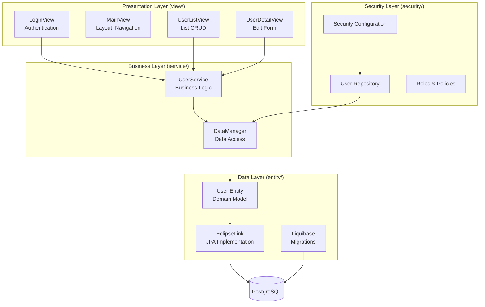
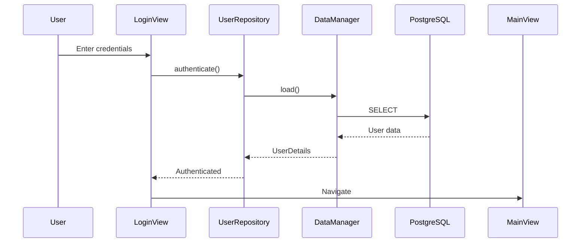

# Architecture

Jmix-based enterprise application following Clean Architecture principles and Vibe Coding standards.

## C4 Model

### Level 1: System Context



**Actors:**
- **End User**: Accesses application via web browser
- **Developer**: Contributes code, uses CI/CD

**External Systems:**
- **PostgreSQL**: Primary data store
- **SonarCloud**: Code quality analysis
- **Grafana + Loki**: Observability and monitoring

### Level 2: Container Diagram



**Containers:**
1. **Web Browser**: Vaadin client-side components
2. **Spring Boot Application**: Main application container (JVM)
3. **PostgreSQL Database**: Data persistence
4. **Observability Stack**: Monitoring and logging

### Level 3: Component Diagram



## Package Structure

```
com.digtp.start/
├── config/              # Configuration classes
├── entity/              # JPA entities
├── security/            # Security configuration
├── service/             # Business logic
├── view/                # UI views
│   ├── login/
│   ├── main/
│   └── user/
└── StartApplication.java
```

## Component Dependencies

**View Dependencies:**
- Views depend on Services (business logic)
- Views use Jmix framework services (Messages, UiComponents, DataManager)
- Views do NOT depend on entities directly

**Service Dependencies:**
- Services depend on DataManager (data access)
- Services depend on framework services (PasswordEncoder, etc.)
- Services do NOT depend on Views

**Entity Dependencies:**
- Entities are independent (domain models)
- No dependencies on other application layers

## Data Flow

**Read Operation:**
```
View → CollectionLoader → DataManager → FetchPlan → EclipseLink → PostgreSQL
```

**Write Operation:**
```
View → Service → DataManager → EclipseLink → PostgreSQL
```

### User Authentication Flow



## Technology Stack

| Component | Technology | Version |
|-----------|------------|---------|
| **Language** | Java | 21 |
| **Framework** | Jmix | 2.7.1 |
| **UI** | Vaadin | 24+ |
| **Application** | Spring Boot | 3.x |
| **Database** | PostgreSQL | 16 |
| **ORM** | EclipseLink | Latest |
| **Migrations** | Liquibase | Latest |
| **Build** | Gradle | 8.12.x |
| **Quality** | Palantir Baseline | 6.76.0 |

## Layer Architecture

### Entity Layer (`entity/`)
- Domain models and JPA entities
- Patterns: `@JmixEntity`, `@Entity`, `@Version`, Lombok
- Rules: Use `dataManager.create()`, UUID primary keys

### Service Layer (`service/`)
- Business logic and transactions
- Patterns: `@Service`, constructor injection, `@Transactional`
- Rules: No view dependencies, use `DataManager` for data operations

### View Layer (`view/`)
- UI components and user interaction
- Patterns: Extend `StandardListView<T>` or `StandardDetailView<T>`, `@ViewComponent`
- Rules: No direct repository access, use services for business logic

### Security Layer (`security/`)
- Authentication and authorization
- Patterns: `@ResourceRole`, `@RowLevelRole`, `@EntityPolicy`
- Rules: Use Jmix security annotations, least privilege

### Configuration Layer (`config/`)
- Application configuration
- Patterns: `@Configuration`, `@Bean`, environment-based config
- Rules: Use `@Value` for property injection, avoid `System.getenv()`

## Design Patterns

### Clean Architecture
- **Dependency Rule**: Inner layers don't depend on outer layers
- **Separation of Concerns**: Clear boundaries between layers
- **Dependency Injection**: Constructor injection throughout

### SOLID Principles
- **Single Responsibility**: Each class has one reason to change
- **Open/Closed**: Open for extension, closed for modification
- **Liskov Substitution**: Subtypes must be substitutable
- **Interface Segregation**: Many specific interfaces
- **Dependency Inversion**: Depend on abstractions

## Deployment

### Docker
- Base Image: `eclipse-temurin:21-jre-alpine`
- Multi-stage build
- Health checks: Spring Boot Actuator

### Kubernetes
- Deployment: Stateless application
- Service: ClusterIP for internal access
- Ingress: External access (optional)
- ConfigMap: Application configuration
- Secrets: Sensitive data

### Helm
- Chart: `helm/start/`
- Values: Configurable via `values.yaml`
- Templates: Kubernetes manifests

## References

- [Jmix Documentation](https://docs.jmix.io/jmix/)
- [Vaadin Documentation](https://vaadin.com/docs)
- [Spring Boot Reference](https://docs.spring.io/spring-boot/docs/current/reference/html/)
- [C4 Model](https://c4model.com/)
