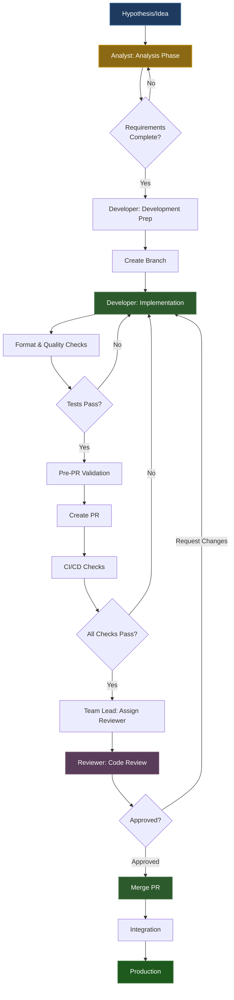
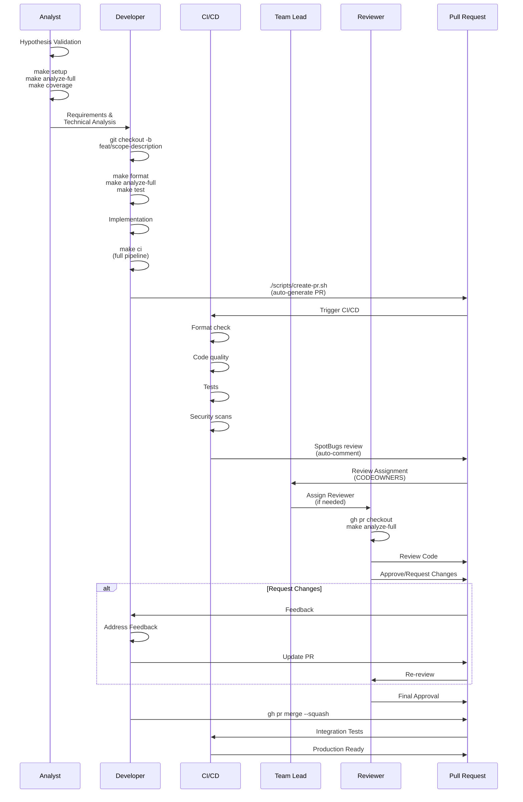
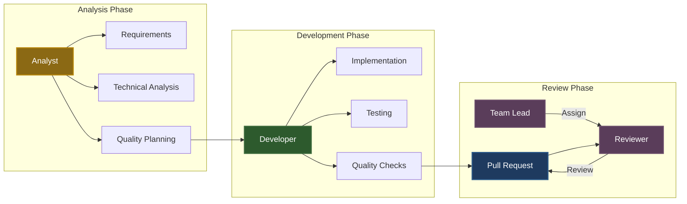
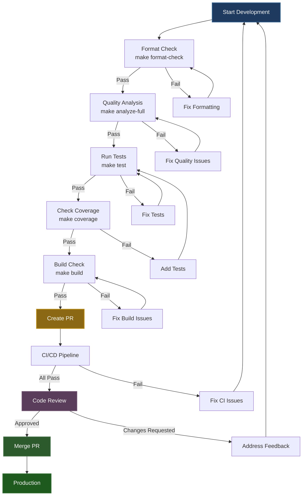
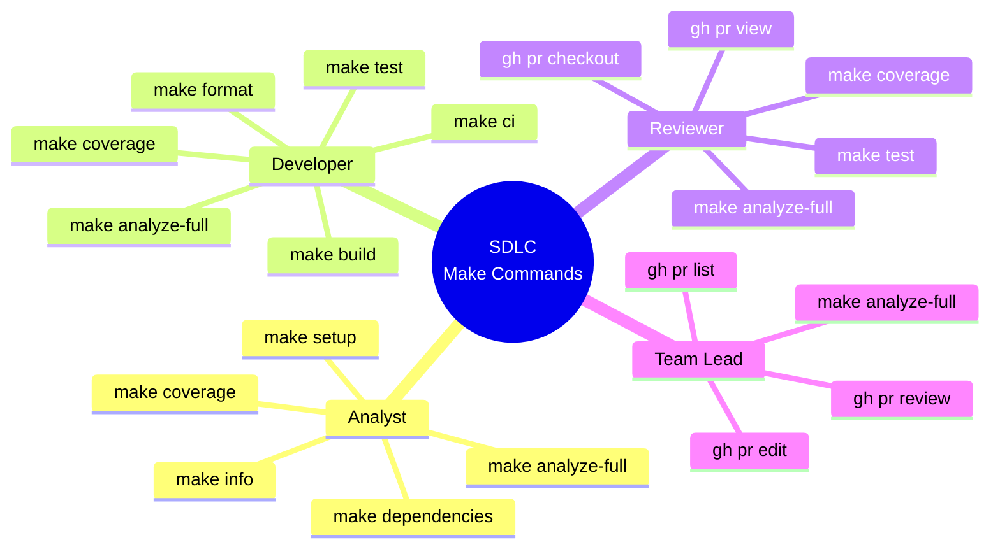
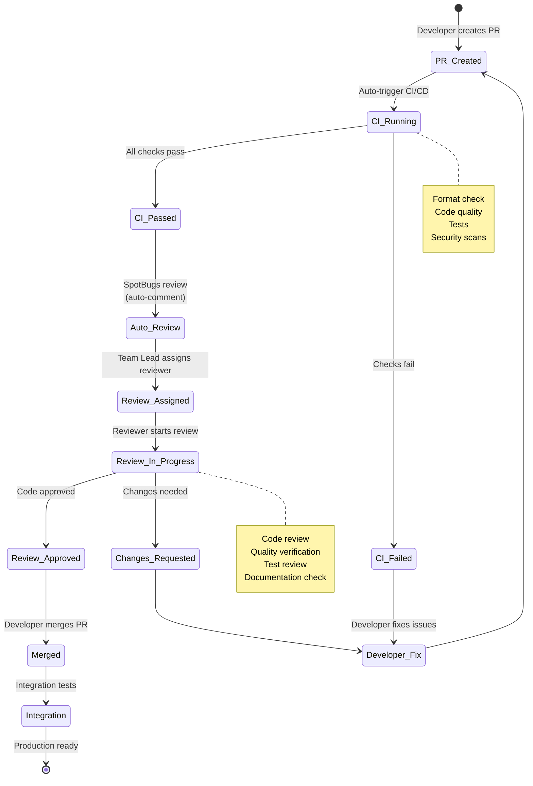
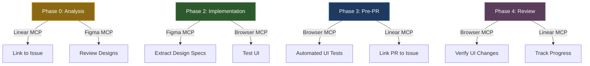

# Software Development Life Cycle (SDLC) for Vibe Coding

This document describes the Software Development Life Cycle (SDLC) integrated with Vibe Coding principles for the Start project.

## Overview

Vibe Coding SDLC emphasizes quality at every phase, with strict quality gates and minimal suppressions. The goal is production-ready code from day one.

## SDLC Phases

### 1. Planning Phase

**Objectives:**
- Define requirements
- Design architecture
- Plan quality gates

**Activities:**
- Requirements gathering
- Architecture design
- Quality gate planning
- Risk assessment

**Deliverables:**
- Requirements document
- Architecture design
- Quality gate checklist

**Vibe Coding Integration:**
- Plan for minimal suppressions
- Identify framework-specific patterns early
- Design for testability

### 2. Development Phase

**Objectives:**
- Write production-ready code
- Follow Vibe Coding principles
- Maintain quality standards

**Activities:**
- Code implementation
- Code formatting (`make format`)
- Local quality checks (`make analyze-full`)
- Unit test writing

**Quality Gates:**
- Code must compile without warnings
- Formatting must pass (`spotlessCheck`)
- Local quality checks must pass
- Unit tests must pass

**Vibe Coding Principles:**
- **Minimal Suppressions**: Fix root causes, not symptoms
- **Framework-Specific Only**: Suppress only for Jmix/Vaadin/Lombok
- **Production-Ready**: Write code as if deploying immediately
- **Document Suppressions**: Explain why suppressions are needed

**Commands:**
```bash
# Format code
make format

# Check quality locally
make analyze-full

# Run tests
make test
```

### 3. Testing Phase

**Objectives:**
- Ensure code quality
- Verify functionality
- Meet coverage thresholds

**Activities:**
- Unit testing
- Integration testing
- Coverage verification
- Mutation testing (optional)

**Quality Gates:**
- **Coverage Thresholds**:
  - Instructions: 85%
  - Branches: 75%
  - Lines: 90%
- All tests must pass
- No failing tests allowed

**Vibe Coding Integration:**
- Tests must be production-quality
- Test edge cases and error conditions
- Use proper test patterns (see [Test Examples](examples/test-example.java))

**Commands:**
```bash
# Run tests
make test

# Check coverage
make coverage

# Mutation testing
make mutation
```

### 4. Code Review Phase

**Objectives:**
- Ensure code quality
- Verify Vibe Coding compliance
- Share knowledge

**Activities:**
- Pull request creation
- Code review
- Quality gate verification
- Documentation review

**Quality Gates:**
- All CI/CD checks must pass
- Code review approval required
- Quality gates verified
- Documentation updated

**Vibe Coding Checklist:**
- [ ] No unnecessary suppressions
- [ ] Suppressions documented
- [ ] Framework-specific suppressions only
- [ ] Root causes fixed, not symptoms
- [ ] Production-ready code
- [ ] Tests added/updated
- [ ] Coverage thresholds met

**PR Requirements:**
- Follow [Conventional Commits](https://www.conventionalcommits.org/)
- Include description of changes
- Link related issues
- Ensure all checks pass

### 5. Integration Phase

**Objectives:**
- Integrate changes
- Verify system stability
- Maintain quality

**Activities:**
- Merge to integration branch
- Integration testing
- Quality gate verification
- System testing

**Quality Gates:**
- All CI/CD jobs must pass
- Integration tests must pass
- No regressions
- Quality metrics maintained

**Vibe Coding Integration:**
- Maintain quality standards
- Monitor quality metrics
- Address any quality degradation

### 6. Deployment Phase

**Objectives:**
- Deploy to production
- Monitor system health
- Ensure stability

**Activities:**
- Build artifacts
- Deploy to environment
- Health checks
- Monitoring setup

**Quality Gates:**
- Build must succeed
- Health checks must pass
- No critical issues
- Monitoring active

**Vibe Coding Integration:**
- Production-ready code (already verified)
- Proper error handling
- Comprehensive logging
- Observability enabled

## Quality Gates at Each Phase

### Development Phase Gates

| Gate | Tool | Threshold | Command |
|------|------|-----------|---------|
| Formatting | Spotless | Must pass | `make format-check` |
| Checkstyle | Checkstyle | `maxWarnings=0` | `make analyze-full` |
| PMD | PMD | `ignoreFailures=false` | `make analyze-full` |
| SpotBugs | SpotBugs | `ignoreFailures=false` | `make analyze-full` |
| SonarLint | SonarLint | `ignoreFailures=false` | `make analyze-full` |

### Testing Phase Gates

| Gate | Tool | Threshold | Command |
|------|------|-----------|---------|
| Unit Tests | JUnit 5 | All pass | `make test` |
| Coverage (Instructions) | JaCoCo | ≥85% | `make coverage` |
| Coverage (Branches) | JaCoCo | ≥75% | `make coverage` |
| Coverage (Lines) | JaCoCo | ≥90% | `make coverage` |

### Code Review Phase Gates

| Gate | Tool | Threshold | Location |
|------|------|-----------|----------|
| CI/CD Pipeline | GitHub Actions | All jobs pass | `.github/workflows/ci.yml` |
| SonarCloud Quality Gate | SonarCloud | Must pass | SonarCloud dashboard |
| Security Scan | OWASP, Trivy | No critical issues | CI/CD pipeline |

## Vibe Coding Workflow

```
1. Planning
   ↓
2. Development
   ├─ Format code (make format)
   ├─ Check quality (make analyze-full)
   └─ Write tests
   ↓
3. Testing
   ├─ Run tests (make test)
   └─ Verify coverage (make coverage)
   ↓
4. Code Review
   ├─ Create PR
   ├─ CI/CD checks
   └─ Review approval
   ↓
5. Integration
   ├─ Merge to develop
   └─ Integration tests
   ↓
6. Deployment
   ├─ Build artifacts
   └─ Deploy to production
```

## From Hypothesis to Production-Ready PR

This section describes the complete workflow from initial hypothesis/idea to a production-ready PR that passes review.

### Workflow Overview



### Phase 0: Hypothesis & Analysis

**Role: Analyst**

**Objectives:**
- Validate hypothesis
- Define requirements
- Plan implementation approach
- Verify feasibility

**Activities:**

1. **Hypothesis Validation**
   - Document the hypothesis/idea
   - Identify stakeholders
   - Gather requirements
   - Assess impact

2. **Technical Analysis**
   - Review existing codebase
   - Identify affected components
   - Plan architecture changes
   - Estimate complexity

3. **Quality Planning**
   - Identify test scenarios
   - Plan quality gates
   - Document expected behavior
   - Define acceptance criteria

**Analyst Make Commands:**

See [Quick Start Guide](../QUICK_START.md#for-analysts) or [Roles Guide - Analyst](../ROLES.md#-analyst) for command reference.

**Deliverables:**
- Requirements document
- Technical analysis
- Architecture proposal
- Quality plan
- Test scenarios

**Next Step:** Hand off to Developer or proceed to Development Phase

### Phase 1: Development Preparation

**Role: Developer**

**Objectives:**
- Set up development environment
- Create feature branch
- Prepare development workspace

**Activities:**

1. **Branch Creation**
   ```bash
   # Create branch following naming convention
   git checkout -b feat/scope-description
   # Example: git checkout -b feat/service-add-payment-calculation
   ```

2. **Environment Setup**
   ```bash
   make setup          # Setup project
   make check-setup    # Verify environment
   ```

3. **Baseline Verification**
   ```bash
   make analyze-full   # Check quality baseline
   make test          # Verify tests pass
   ```

**See**: [Quick Start Guide](../QUICK_START.md) for all commands.

**Quality Gates:**
- Project compiles without errors
- All existing tests pass
- Quality baseline established

### Phase 2: Implementation

**Role: Developer**

**Objectives:**
- Implement feature/fix
- Maintain code quality
- Write tests
- Follow Vibe Coding principles

**Activities:**

1. **Code Implementation**
   - Write production-ready code
   - Follow project conventions
   - Apply SOLID principles
   - Document complex logic

2. **Continuous Quality Checks**
   ```bash
   make format         # Format code frequently
   make analyze-full   # Check quality after changes
   make test          # Run tests during development
   ```

3. **Test Development**
   - Write unit tests
   - Add integration tests if needed
   - Ensure coverage thresholds met
   ```bash
   make coverage      # Check coverage
   ```

**See**: [Quick Start Guide](../QUICK_START.md#for-developers) for all commands.

**Quality Gates:**
- Code compiles without warnings
- Formatting passes (`make format-check`)
- Quality checks pass (`make analyze-full`)
- Tests pass (`make test`)
- Coverage thresholds met (`make coverage`)

### Phase 3: Pre-PR Validation

**Role: Developer**

**Objectives:**
- Ensure PR is ready for review
- Verify all quality gates pass
- Prepare PR description

**Activities:**

1. **Final Quality Check**
   ```bash
   make ci            # Full CI pipeline
   ```

2. **Commit Messages**
   - Follow Conventional Commits format (see [Conventional Commits](../../.cursor/rules/conventional-commits.mdc))
   - Use proper type and scope
   - Write clear descriptions

3. **PR Creation**
   ```bash
   ./scripts/create-pr.sh  # Auto-generate PR with description
   ```

**See**: [Quick Start Guide](../QUICK_START.md#common-workflows) for complete workflow.

**Quality Gates:**
- All local checks pass
- Branch name follows convention
- Commit messages follow convention
- PR description is complete

### Phase 4: Code Review

**Role: Reviewer (Team Lead or assigned reviewer)**

**Objectives:**
- Verify code quality
- Ensure Vibe Coding compliance
- Validate implementation
- Approve or request changes

**Review Process:**

1. **Automatic Checks (CI/CD)**
   - Format check
   - Code quality analysis
   - Tests execution
   - Security scans
   - SpotBugs review (auto-commented on PR)

2. **Manual Review Checklist**
   - [ ] Code follows project conventions
   - [ ] No unnecessary suppressions
   - [ ] Suppressions are documented
   - [ ] Tests are comprehensive
   - [ ] Coverage thresholds met
   - [ ] Documentation updated if needed
   - [ ] PR description is clear

3. **Reviewer Assignment**

   **Automatic Assignment:**
   - CODEOWNERS file defines default reviewers
   - GitHub automatically assigns based on CODEOWNERS
   - See `.github/CODEOWNERS` for configuration

   **Manual Assignment by Team Lead:**
   ```bash
   # Assign reviewer via GitHub CLI
   gh pr edit <pr-number> --add-reviewer @username
   
   # Or via web interface
   # Go to PR → Reviewers → Add reviewer
   ```

   **Reviewer Selection Criteria:**
   - Domain expertise (for feature scope)
   - Code ownership (CODEOWNERS)
   - Availability
   - Team Lead discretion

4. **Review Actions**

   **Approve:**
   - All checks pass
   - Code quality verified
   - Ready to merge

   **Request Changes:**
   - Issues identified
   - Quality gates not met
   - Documentation missing
   - Tests insufficient

   **Comment:**
   - Suggestions for improvement
   - Questions about implementation
   - Non-blocking feedback

**Reviewer Commands:**

See [Roles Guide - Reviewer](../ROLES.md#-reviewer) for complete command reference.

### Phase 5: Merge & Integration

**Role: Developer (after approval)**

**Objectives:**
- Merge approved PR
- Verify integration
- Monitor quality

**Activities:**

1. **Merge PR**
   ```bash
   # Squash merge (recommended)
   gh pr merge <pr-number> --squash
   
   # Or via web interface
   ```

2. **Post-Merge Verification**
   - Monitor CI/CD pipeline
   - Verify integration tests
   - Check quality metrics

**Quality Gates:**
- All CI/CD jobs pass
- Integration tests pass
- No regressions
- Quality metrics maintained

## Quick References

### Analyst Commands
See [Roles Guide - Analyst](../ROLES.md#-analyst) for complete command reference.

### Team Lead Commands
See [Roles Guide - Team Lead](../ROLES.md#-team-lead) for complete command reference.

### Developer Commands
See [Roles Guide - Developer](../ROLES.md#-developer) for complete command reference.

### Reviewer Commands
See [Roles Guide - Reviewer](../ROLES.md#-reviewer) for complete command reference.

## Complete Workflow Diagram

### Detailed Process Flow



### Roles and Responsibilities



### Quality Gates Flow



### Make Commands by Role



### Code Review Process



## Best Practices

### During Development

1. **Run Quality Checks Frequently**
   ```bash
   make analyze-full
   ```

2. **Format Code Before Committing**
   ```bash
   make format
   ```

3. **Write Tests Alongside Code**
   - Don't defer testing
   - Test edge cases
   - Maintain coverage

4. **Fix Issues Immediately**
   - Don't accumulate technical debt
   - Address quality gate failures
   - Fix root causes

### During Code Review

1. **Verify Quality Gates**
   - Check CI/CD status
   - Review SonarCloud results
   - Verify coverage

2. **Check Suppressions**
   - Are they necessary?
   - Are they documented?
   - Are they framework-specific?

3. **Review Tests**
   - Are tests comprehensive?
   - Do they cover edge cases?
   - Is coverage maintained?

### During Integration

1. **Monitor Quality Metrics**
   - Track coverage trends
   - Monitor complexity
   - Watch for regressions

2. **Address Issues Promptly**
   - Fix failing tests
   - Resolve quality gate failures
   - Update documentation

## Quality Metrics

### Code Quality

- **Cognitive Complexity**: ≤10 per method
- **Cyclomatic Complexity**: ≤10 per method
- **File Length**: ≤250 lines
- **Code Duplication**: <3%

### Test Quality

- **Coverage**: 85%/75%/90% (instructions/branches/lines)
- **Test Quality**: All tests must be meaningful
- **Mutation Score**: ≥70% (if using PIT)

### Security

- **Vulnerabilities**: Zero critical/high
- **Dependencies**: Up to date
- **Security Scan**: Pass all checks

## Tools and Commands

### Development

```bash
# Setup project
make setup

# Format code
make format

# Check quality
make analyze-full

# Run tests
make test

# Check coverage
make coverage
```

### CI/CD

- **Format Check**: `./gradlew spotlessCheck`
- **Quality Check**: `./gradlew codeQualityFull`
- **Tests**: `./gradlew test`
- **Coverage**: `./gradlew jacocoTestReport`
- **SonarCloud**: `./gradlew sonar`

## Continuous Improvement

### Regular Reviews

- Review quality metrics monthly
- Update quality gates as needed
- Refine Vibe Coding principles
- Share learnings with team

### Documentation Updates

- Keep SDLC documentation current
- Update quality gate thresholds
- Document new patterns
- Share best practices

## Cursor MCP Integration

Cursor Model Context Protocol (MCP) servers can enhance the SDLC workflow by integrating external tools directly into the development process. This section describes optional integrations that can improve productivity and reduce context switching.

### Overview

MCP servers allow Cursor to interact with external systems like project management tools, design systems, and browsers. This creates tighter feedback loops and enables more autonomous task execution.

### Available Integrations

#### 1. Linear MCP (Project Management)

**Purpose**: Link issues to PRs, track progress, manage tasks

**Setup**:
1. Add to `mcp.json`:
   ```json
   {
     "mcpServers": {
       "Linear": {
         "command": "npx",
         "args": ["-y", "mcp-remote", "https://mcp.linear.app/mcp"]
       }
     }
   }
   ```
2. Enable in Cursor MCP settings
3. Authorize with Linear

**Usage in SDLC**:
- **Phase 0 (Analysis)**: Link hypothesis to Linear issue
  ```bash
  # In Cursor Chat:
  "List all issues related to this project"
  "Create issue for payment calculation feature"
  ```
- **Phase 1 (Development)**: Reference issue in branch/PR
  ```bash
  # Branch naming can include issue ID
  git checkout -b feat/service-add-payment-calculation-LIN-123
  ```
- **Phase 4 (Code Review)**: Auto-link PR to Linear issue
  ```markdown
  <!-- In PR description -->
  Closes LIN-123
  Related to LIN-124
  ```

**Benefits**:
- Automatic issue tracking
- PR-issue linking
- Progress visibility
- Reduced manual work

#### 2. Figma MCP (Design System)

**Purpose**: Access design files, extract design specs, implement UI from designs

**Setup**:
1. Install Figma Dev Mode MCP Server (see [Figma documentation](https://help.figma.com/hc/en-us/articles/32132100833559-Guide-to-the-Dev-Mode-MCP-Server))
2. Add to `mcp.json`:
   ```json
   {
     "mcpServers": {
       "Figma": {
         "url": "http://127.0.0.1:3845/sse"
       }
     }
   }
   ```

**Usage in SDLC**:
- **Phase 0 (Analysis)**: Review designs for UI features
  ```bash
  # In Cursor Chat:
  "Show me the designs for the current selection in Figma"
  "Get design context for the login page"
  ```
- **Phase 2 (Implementation)**: Implement UI from Figma designs
  ```bash
  # Cursor can access design specs directly
  "Implement the user list view based on the Figma design"
  ```
- **Phase 3 (Testing)**: Verify implementation matches design

**Benefits**:
- Direct access to design files
- Reduced design-to-code translation errors
- Faster UI implementation
- Design system consistency

**Note**: Requires Figma Dev Mode and MCP server setup. See [Figma Dev Mode MCP Server Guide](https://help.figma.com/hc/en-us/articles/32132100833559-Guide-to-the-Dev-Mode-MCP-Server).

#### 3. Browser MCP (UI Testing)

**Purpose**: Automated browser testing, UI verification, debugging

**Setup**: Built-in to Cursor (no additional setup required)

**Usage in SDLC**:
- **Phase 2 (Implementation)**: Test UI during development
  ```bash
  # In Cursor Chat:
  "Open the app in the browser and check for console errors"
  "Navigate to the login page and test the form submission"
  "Take a screenshot of the current page"
  ```
- **Phase 3 (Pre-PR Validation)**: Automated UI testing
  ```bash
  "Test the user registration flow end-to-end"
  "Check for console errors and network issues"
  ```
- **Phase 4 (Code Review)**: Verify UI changes
  ```bash
  "Test the new payment form in the browser"
  "Verify all buttons work correctly"
  ```

**Benefits**:
- Automated UI testing
- Console error detection
- Network request monitoring
- Visual verification
- Reduced manual testing

**Capabilities**:
- Navigate pages
- Fill forms
- Click elements
- Inspect console logs
- Monitor network requests
- Take screenshots
- Wait for elements/conditions

### Component Reuse Rules

For UI development, create rules to enforce component reuse and design system consistency.

**Example Rule File**: `.cursor/rules/ui-components.mdc`

```markdown
---
description: Implementing designs and building UI
---
- Reuse existing UI components from Vaadin component library
- Use Jmix StandardListView/StandardDetailView patterns
- Follow existing view patterns in `view/` package
- Create new components by composing existing Vaadin components
- Ask the human how they want to proceed when there are missing components and designs
- Follow Vaadin best practices (see @vaadin-best-practices.mdc)
```

**Usage**:
- Cursor automatically references these rules when working with UI
- Ensures consistency across views
- Reduces code duplication
- Maintains design system integrity

### Integration Workflow



### Best Practices

1. **Start Simple**: Begin with Browser MCP (built-in, no setup)
2. **Add Gradually**: Integrate Linear/Figma only if you use those tools
3. **Use Rules**: Create component reuse rules for UI consistency
4. **Maintain Context**: Keep MCP servers updated and authorized
5. **Document Usage**: Update team on available integrations

### Optional vs Required

**Required**: None - MCP integrations are optional enhancements

**Recommended**:
- Browser MCP: Always useful for UI testing
- Linear MCP: If using Linear for issue tracking
- Figma MCP: If using Figma for designs

### Troubleshooting

**Linear MCP Issues**:
- Verify authorization in Cursor MCP settings
- Check Linear API access
- Ensure `mcp.json` configuration is correct

**Figma MCP Issues**:
- Verify Figma Dev Mode is running
- Check MCP server is accessible at configured URL
- Ensure Figma desktop app is open

**Browser MCP Issues**:
- Built-in, should work automatically
- Check Cursor Browser settings if needed

## Working with Large Codebases

As the codebase grows, effective use of Cursor tools becomes critical for maintaining productivity. This section describes patterns for navigating, understanding, and modifying large codebases efficiently.

### Understanding Unfamiliar Code

**Challenge**: Navigating a large codebase, especially unfamiliar areas, can be time-consuming.

**Solution**: Use Cursor Chat to quickly understand code structure and implementation details.

**Usage in SDLC**:
- **Phase 0 (Analysis)**: Understand existing patterns before planning
  ```bash
  # In Cursor Chat:
  "How does user authentication work in this codebase?"
  "Show me examples of how services are implemented"
  "Explain the data access patterns used here"
  ```
- **Phase 1 (Development Prep)**: Explore related code before implementation
  ```bash
  "Find all views that use UserService"
  "Show me how similar features are implemented"
  "What patterns are used for form validation?"
  ```

**Benefits**:
- Faster onboarding for new team members
- Better understanding of existing patterns
- Reduced time searching through code
- Context-aware explanations

### Domain-Specific Rules

**Challenge**: Project-specific knowledge and patterns may not be fully documented.

**Solution**: Create Cursor rules that capture domain knowledge and implementation patterns.

**Existing Rules Structure**:
- Core rules: `rules.mdc`, `ai-rules.mdc`, `context-management.mdc`
- Framework-specific: `jmix-*.mdc`, `vaadin-*.mdc`
- Quality: `code-quality.mdc`, `suppress-policy.mdc`
- Patterns: `error-handling.mdc`, `async-patterns.mdc`, `api-design.mdc`

**When to Create New Rules**:
1. **New Feature Pattern**: Document how to implement similar features
   ```markdown
   ---
   description: Add a new Jmix service
   ---
   1. Create service interface in `service/` package
   2. Implement with @Service annotation
   3. Use @RequiredArgsConstructor for dependencies
   4. Follow existing service patterns (see @UserService.java)
   ```

2. **Common Formatting Patterns**: Auto-attach via globs
   ```markdown
   ---
   globs: *.java
   ---
   - Use final fields where possible
   - Constructor injection for dependencies
   - Lombok @RequiredArgsConstructor
   ```

3. **Project-Specific Conventions**: Document team decisions
   ```markdown
   ---
   description: Entity naming conventions
   ---
   - Entities: PascalCase, singular (User, not Users)
   - Services: PascalCase + Service suffix (UserService)
   - Views: PascalCase + View suffix (UserListView)
   ```

**Best Practices**:
- Reference existing code: `@UserService.java` instead of copying
- Keep rules concise: <100 lines for detailed guides
- Use globs for context-specific loading
- Review quarterly for relevance (see `@rules-improvement.mdc`)

### Planning Before Implementation

**Challenge**: Large changes require careful planning to avoid rework and ensure consistency.

**Solution**: Use Cursor Ask mode to create detailed plans before implementation.

**Usage in SDLC**:
- **Phase 0 (Analysis)**: Create implementation plan
  ```bash
  # In Cursor Chat (Ask mode):
  "Create a plan for implementing payment calculation feature
   - Similar to @PaymentService.java
   - Ask me questions (max 3) if anything is unclear
   - Make sure to search the codebase
   
   Context from issue tracker:
   [pasted ticket description]"
  ```

- **Phase 1 (Development Prep)**: Refine plan with Cursor
  ```bash
  "Based on the plan, what files will need to be modified?"
  "What dependencies should I be aware of?"
  "Are there any similar implementations I should reference?"
  ```

**Planning Process**:
1. **Gather Context**: Include relevant files, folders, issue descriptions
2. **Ask Questions**: Let Cursor ask clarifying questions (max 3)
3. **Search Codebase**: Ensure Cursor explores existing patterns
4. **Iterate**: Refine plan based on Cursor's suggestions
5. **Implement**: Use refined plan for implementation

**Recommended Models for Planning**:
- `claude-sonnet-4.5`: Best for understanding intent
- `gpt-5-codex`: Good for code synthesis
- `gemini-2.5-pro`: Alternative option

**Benefits**:
- Better scoped changes
- Reduced rework
- Consistent with existing patterns
- Clearer implementation path

### Choosing the Right Tool

**Challenge**: Different tasks require different approaches for efficiency.

**Solution**: Match Cursor tools to task scope and complexity.

**Tool Selection Guide**:

| Tool | Use Case | When to Use | Example |
|------|----------|-------------|---------|
| **Tab** | Quick, manual changes | Single file, simple edits | Fix typo, rename variable |
| **Inline Edit** | Scoped changes in one file | Focused section edits | Update method implementation |
| **Chat** | Larger, multi-file changes | Complex refactoring, new features | Add new service with tests |

**Usage by SDLC Phase**:

**Phase 0 (Analysis)**:
- **Chat**: Understand codebase structure, explore patterns
- **Tab/Inline Edit**: Not typically used

**Phase 1 (Development Prep)**:
- **Chat**: Create plan, explore dependencies
- **Tab**: Quick file navigation

**Phase 2 (Implementation)**:
- **Chat**: Multi-file changes, complex features
- **Inline Edit**: Focused method/class changes
- **Tab**: Quick fixes, small edits

**Phase 3 (Pre-PR Validation)**:
- **Tab**: Quick formatting fixes
- **Inline Edit**: Address review comments
- **Chat**: Larger refactoring if needed

**Phase 4 (Code Review)**:
- **Tab**: Quick fixes during review
- **Inline Edit**: Address specific review points
- **Chat**: Complex changes if requested

**Best Practices**:
1. **Start Small**: Use Tab for quick edits
2. **Scope Appropriately**: Use Chat for multi-file changes
3. **Stay Focused**: Create new chats for different features
4. **Provide Context**: Use `@files` and `@folders` in Chat
5. **Break Down**: Split large changes into smaller chunks

### Context Management

**Challenge**: Large codebases have extensive context that can overwhelm AI models.

**Solution**: Strategic use of context mentions and codebase search.

**Context Strategies**:
1. **File Mentions**: `@UserService.java` - Reference specific files
2. **Folder Mentions**: `@service/` - Give structural understanding
3. **Rule References**: `@jmix-best-practices.mdc` - Apply domain knowledge
4. **Codebase Search**: Let Cursor search for similar patterns

**Example Workflow**:
```bash
# In Cursor Chat:
"Add a new PaymentService similar to @UserService.java
 - Follow patterns in @service/ folder
 - Use @jmix-best-practices.mdc for data access
 - Add tests following @UserServiceTest.java pattern"
```

**Context Efficiency**:
- ✅ Reference files instead of copying code
- ✅ Use rule files for patterns
- ✅ Let Cursor search codebase
- ❌ Don't paste large code blocks
- ❌ Don't load all rules for simple tasks

### Workflow Optimization

**For Large Changes**:
1. **Plan First**: Use Ask mode to create detailed plan
2. **Break Down**: Split into smaller, focused changes
3. **New Chats**: Start fresh chat for each feature
4. **Iterate**: Refine based on results

**For Quick Fixes**:
1. **Tab**: Direct edits for simple changes
2. **Inline Edit**: Focused section edits
3. **Avoid Chat**: Don't use Chat for single-line changes

**For Exploration**:
1. **Chat**: Ask questions about codebase
2. **Search**: Let Cursor find relevant code
3. **Reference**: Use `@files` to point to examples

### Visualizing with Mermaid Diagrams

**Challenge**: Understanding complex flows, data lineage, and component interactions in large codebases.

**Solution**: Use Cursor to generate Mermaid diagrams that visualize architecture, flows, and relationships.

**Why Diagrams Matter**:
- Clarify data flow from input to output
- Understand component interactions
- Trace logic flow through the system
- Onboard new team members
- Debug complex issues
- Communicate system structure

**Usage in SDLC**:

**Phase 0 (Analysis)**: Understand existing architecture
```bash
# In Cursor Chat:
"Show me how requests go from the controller to the database"
"Create a sequence diagram for user authentication flow"
"Diagram the component structure of the service layer"
```

**Phase 1 (Development Prep)**: Plan data flow and interactions
```bash
"Trace this variable from where it enters to where it ends up"
"Show me the data flow for payment processing"
"Create a flowchart for the new feature I'm implementing"
```

**Phase 2 (Implementation)**: Verify understanding during development
```bash
"Diagram how this service interacts with other components"
"Show me the sequence of method calls in this flow"
```

**Phase 4 (Code Review)**: Visualize changes for reviewers
```bash
"Create a diagram showing how this PR changes the data flow"
"Visualize the new component relationships"
```

**Mermaid Diagram Types**:

1. **Flowcharts** (`flowchart` or `graph TD`): Logic flow, processes
   ```mermaid
   graph TD
       A[Start] --> B{Decision}
       B -->|Yes| C[Action 1]
       B -->|No| D[Action 2]
       C --> E[End]
       D --> E
   ```

2. **Sequence Diagrams** (`sequenceDiagram`): Interactions over time
   ```mermaid
   sequenceDiagram
       participant User
       participant Service
       participant Database
       User->>Service: Request
       Service->>Database: Query
       Database-->>Service: Result
       Service-->>User: Response
   ```

3. **Class Diagrams** (`classDiagram`): Object structure and relationships
   ```mermaid
   classDiagram
       class UserService {
           +createUser()
           +updateUser()
       }
       class User {
           +id
           +username
       }
       UserService --> User
   ```

**Diagram Strategy (C4 Model Approach)**:

Start small and build upward, following the C4 model:

1. **Level 1 - Low-level (Code/Components)**:
   ```bash
   "Diagram this specific method's flow"
   "Show me how this service class is structured"
   ```

2. **Level 2 - Mid-level (Services/Modules)**:
   ```bash
   "Create a component diagram for the service layer"
   "Show how payment and user services interact"
   ```

3. **Level 3 - High-level (System)**:
   ```bash
   "Combine these diagrams into a system overview"
   "Show the complete application architecture"
   ```

**Recommended Flow**:
1. Start with detailed, low-level diagram
2. Summarize into mid-level view
3. Repeat until reaching desired abstraction
4. Ask Cursor to merge into single system map

**Example Workflow**:
```bash
# Step 1: Low-level component diagram
"Diagram the UserService.createUser() method flow"

# Step 2: Mid-level service interaction
"Show how UserService interacts with DataManager and Security"

# Step 3: High-level system view
"Create a system diagram showing all services and their relationships"
```

**Prompting Tips**:

1. **Be Specific**: Include start and end points
   ```bash
   "Show me how requests go from LoginView to PostgreSQL database"
   ```

2. **Specify Type**: Request specific diagram format
   ```bash
   "Create a sequence diagram for user registration"
   "Make a flowchart showing the payment processing logic"
   ```

3. **Include Context**: Reference relevant files
   ```bash
   "Diagram the flow in @UserService.java"
   "Show component structure of @service/ folder"
   ```

4. **Combine Diagrams**: Merge multiple views
   ```bash
   "Combine the authentication and authorization diagrams"
   "Create a unified system architecture diagram"
   ```

**Mermaid Extension Setup**:

To preview diagrams in Cursor:
1. Go to Extensions tab
2. Search for "Mermaid" 
3. Install "Markdown Preview Mermaid Support" extension
4. Diagrams will render in Markdown preview

**Best Practices**:

1. **Start Small**: Don't try to map everything at once
2. **Iterate**: Refine diagrams based on understanding
3. **Combine**: Merge related diagrams for overview
4. **Document**: Add diagrams to architecture documentation
5. **Update**: Keep diagrams current with code changes

**Integration with Documentation**:

- Add diagrams to `docs/architecture/ARCHITECTURE.md` for system-level views
- Include in PR descriptions for complex changes
- Use in code review to explain flows
- Reference in rules for pattern documentation

**Example Use Cases**:

- **Understanding Flow**: "How does data flow from API to database?"
- **Debugging**: "Trace where this error could originate"
- **Onboarding**: "Show me the overall system architecture"
- **Planning**: "Diagram the new feature's integration points"
- **Review**: "Visualize how this PR changes component interactions"

### Takeaways

- **Use Chat** to quickly understand unfamiliar code
- **Create rules** for domain-specific knowledge and patterns
- **Plan before implementing** large changes using Ask mode
- **Choose the right tool** (Tab/Inline Edit/Chat) for the task
- **Manage context** efficiently with file/folder mentions
- **Break down** large changes into smaller, focused chunks
- **Start fresh chats** for different features to maintain focus

## References

- [Vibe Coding Principles](../CONTRIBUTING.md#vibe-coding-principles)
- [Quality Gates Documentation](QUALITY_GATES.md)
- [CI/CD Documentation](CI_CD.md)
- [Contributing Guide](../CONTRIBUTING.md)
- [Cursor Web Development Guide](https://cursor.com/docs/cookbook/web-development)
- [Cursor Large Codebases Guide](https://cursor.com/docs/cookbook/large-codebases)
- [Cursor Mermaid Diagrams Guide](https://cursor.com/docs/cookbook/mermaid-diagrams)

