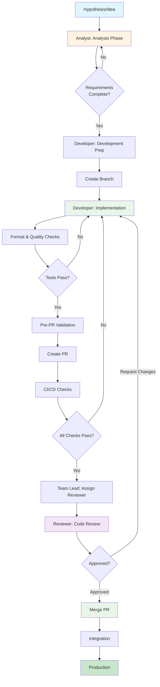
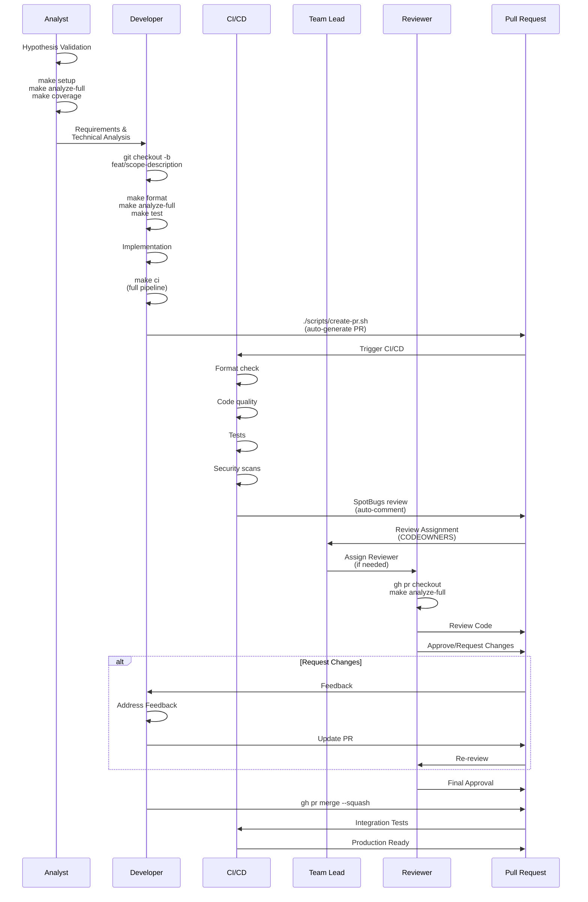
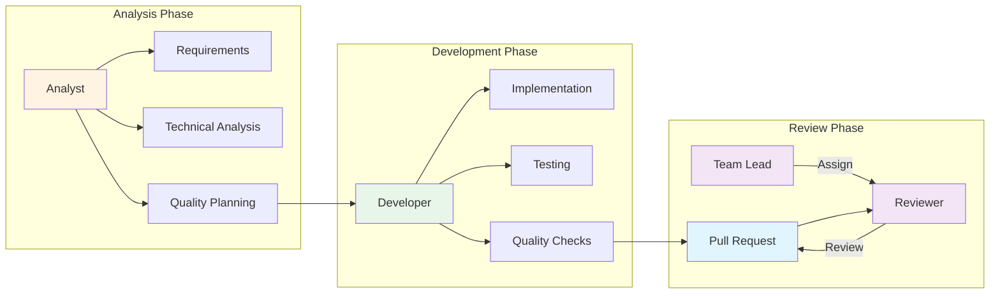
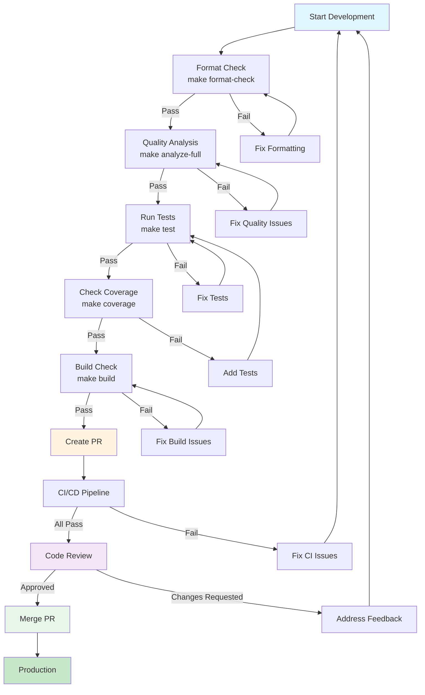
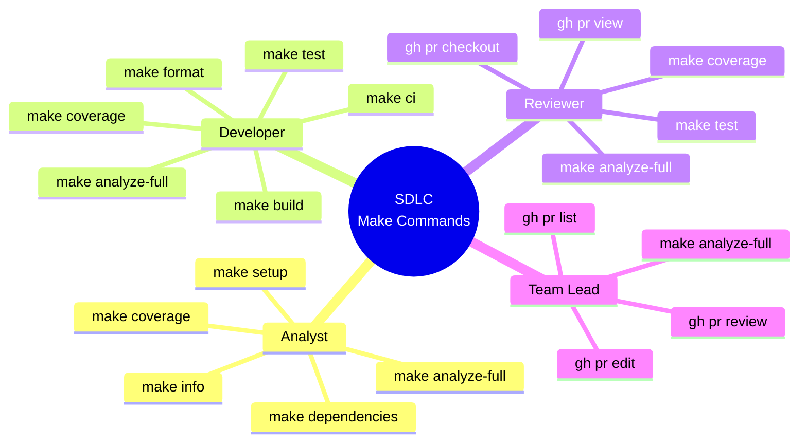
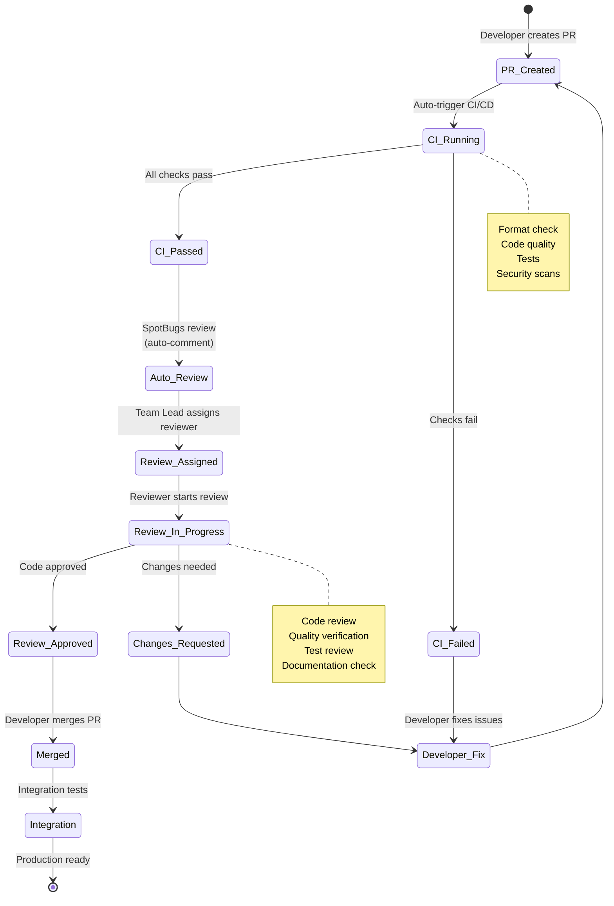

# Software Development Life Cycle (SDLC) for Vibe Coding

This document describes the Software Development Life Cycle (SDLC) integrated with Vibe Coding principles for the Start project.

## Overview

Vibe Coding SDLC emphasizes quality at every phase, with strict quality gates and minimal suppressions. The goal is production-ready code from day one.

## SDLC Phases

### 1. Planning Phase

**Objectives:**
- Define requirements
- Design architecture
- Plan quality gates

**Activities:**
- Requirements gathering
- Architecture design
- Quality gate planning
- Risk assessment

**Deliverables:**
- Requirements document
- Architecture design
- Quality gate checklist

**Vibe Coding Integration:**
- Plan for minimal suppressions
- Identify framework-specific patterns early
- Design for testability

### 2. Development Phase

**Objectives:**
- Write production-ready code
- Follow Vibe Coding principles
- Maintain quality standards

**Activities:**
- Code implementation
- Code formatting (`make format`)
- Local quality checks (`make analyze-full`)
- Unit test writing

**Quality Gates:**
- Code must compile without warnings
- Formatting must pass (`spotlessCheck`)
- Local quality checks must pass
- Unit tests must pass

**Vibe Coding Principles:**
- **Minimal Suppressions**: Fix root causes, not symptoms
- **Framework-Specific Only**: Suppress only for Jmix/Vaadin/Lombok
- **Production-Ready**: Write code as if deploying immediately
- **Document Suppressions**: Explain why suppressions are needed

**Commands:**
```bash
# Format code
make format

# Check quality locally
make analyze-full

# Run tests
make test
```

### 3. Testing Phase

**Objectives:**
- Ensure code quality
- Verify functionality
- Meet coverage thresholds

**Activities:**
- Unit testing
- Integration testing
- Coverage verification
- Mutation testing (optional)

**Quality Gates:**
- **Coverage Thresholds**:
  - Instructions: 85%
  - Branches: 75%
  - Lines: 90%
- All tests must pass
- No failing tests allowed

**Vibe Coding Integration:**
- Tests must be production-quality
- Test edge cases and error conditions
- Use proper test patterns (see [Test Examples](examples/test-example.java))

**Commands:**
```bash
# Run tests
make test

# Check coverage
make coverage

# Mutation testing
make mutation
```

### 4. Code Review Phase

**Objectives:**
- Ensure code quality
- Verify Vibe Coding compliance
- Share knowledge

**Activities:**
- Pull request creation
- Code review
- Quality gate verification
- Documentation review

**Quality Gates:**
- All CI/CD checks must pass
- Code review approval required
- Quality gates verified
- Documentation updated

**Vibe Coding Checklist:**
- [ ] No unnecessary suppressions
- [ ] Suppressions documented
- [ ] Framework-specific suppressions only
- [ ] Root causes fixed, not symptoms
- [ ] Production-ready code
- [ ] Tests added/updated
- [ ] Coverage thresholds met

**PR Requirements:**
- Follow [Conventional Commits](https://www.conventionalcommits.org/)
- Include description of changes
- Link related issues
- Ensure all checks pass

### 5. Integration Phase

**Objectives:**
- Integrate changes
- Verify system stability
- Maintain quality

**Activities:**
- Merge to integration branch
- Integration testing
- Quality gate verification
- System testing

**Quality Gates:**
- All CI/CD jobs must pass
- Integration tests must pass
- No regressions
- Quality metrics maintained

**Vibe Coding Integration:**
- Maintain quality standards
- Monitor quality metrics
- Address any quality degradation

### 6. Deployment Phase

**Objectives:**
- Deploy to production
- Monitor system health
- Ensure stability

**Activities:**
- Build artifacts
- Deploy to environment
- Health checks
- Monitoring setup

**Quality Gates:**
- Build must succeed
- Health checks must pass
- No critical issues
- Monitoring active

**Vibe Coding Integration:**
- Production-ready code (already verified)
- Proper error handling
- Comprehensive logging
- Observability enabled

## Quality Gates at Each Phase

### Development Phase Gates

| Gate | Tool | Threshold | Command |
|------|------|-----------|---------|
| Formatting | Spotless | Must pass | `make format-check` |
| Checkstyle | Checkstyle | `maxWarnings=0` | `make analyze-full` |
| PMD | PMD | `ignoreFailures=false` | `make analyze-full` |
| SpotBugs | SpotBugs | `ignoreFailures=false` | `make analyze-full` |
| SonarLint | SonarLint | `ignoreFailures=false` | `make analyze-full` |

### Testing Phase Gates

| Gate | Tool | Threshold | Command |
|------|------|-----------|---------|
| Unit Tests | JUnit 5 | All pass | `make test` |
| Coverage (Instructions) | JaCoCo | ≥85% | `make coverage` |
| Coverage (Branches) | JaCoCo | ≥75% | `make coverage` |
| Coverage (Lines) | JaCoCo | ≥90% | `make coverage` |

### Code Review Phase Gates

| Gate | Tool | Threshold | Location |
|------|------|-----------|----------|
| CI/CD Pipeline | GitHub Actions | All jobs pass | `.github/workflows/ci.yml` |
| SonarCloud Quality Gate | SonarCloud | Must pass | SonarCloud dashboard |
| Security Scan | OWASP, Trivy | No critical issues | CI/CD pipeline |

## Vibe Coding Workflow

```
1. Planning
   ↓
2. Development
   ├─ Format code (make format)
   ├─ Check quality (make analyze-full)
   └─ Write tests
   ↓
3. Testing
   ├─ Run tests (make test)
   └─ Verify coverage (make coverage)
   ↓
4. Code Review
   ├─ Create PR
   ├─ CI/CD checks
   └─ Review approval
   ↓
5. Integration
   ├─ Merge to develop
   └─ Integration tests
   ↓
6. Deployment
   ├─ Build artifacts
   └─ Deploy to production
```

## From Hypothesis to Production-Ready PR

This section describes the complete workflow from initial hypothesis/idea to a production-ready PR that passes review.

### Workflow Overview



### Phase 0: Hypothesis & Analysis

**Role: Analyst**

**Objectives:**
- Validate hypothesis
- Define requirements
- Plan implementation approach
- Verify feasibility

**Activities:**

1. **Hypothesis Validation**
   - Document the hypothesis/idea
   - Identify stakeholders
   - Gather requirements
   - Assess impact

2. **Technical Analysis**
   - Review existing codebase
   - Identify affected components
   - Plan architecture changes
   - Estimate complexity

3. **Quality Planning**
   - Identify test scenarios
   - Plan quality gates
   - Document expected behavior
   - Define acceptance criteria

**Analyst Make Commands:**

See [Quick Start Guide](../QUICK_START.md#for-analysts) or [Roles Guide - Analyst](../ROLES.md#-analyst) for command reference.

**Deliverables:**
- Requirements document
- Technical analysis
- Architecture proposal
- Quality plan
- Test scenarios

**Next Step:** Hand off to Developer or proceed to Development Phase

### Phase 1: Development Preparation

**Role: Developer**

**Objectives:**
- Set up development environment
- Create feature branch
- Prepare development workspace

**Activities:**

1. **Branch Creation**
   ```bash
   # Create branch following naming convention
   git checkout -b feat/scope-description
   # Example: git checkout -b feat/service-add-payment-calculation
   ```

2. **Environment Setup**
   ```bash
   make setup          # Setup project
   make check-setup    # Verify environment
   ```

3. **Baseline Verification**
   ```bash
   make analyze-full   # Check quality baseline
   make test          # Verify tests pass
   ```

**See**: [Quick Start Guide](../QUICK_START.md) for all commands.

**Quality Gates:**
- Project compiles without errors
- All existing tests pass
- Quality baseline established

### Phase 2: Implementation

**Role: Developer**

**Objectives:**
- Implement feature/fix
- Maintain code quality
- Write tests
- Follow Vibe Coding principles

**Activities:**

1. **Code Implementation**
   - Write production-ready code
   - Follow project conventions
   - Apply SOLID principles
   - Document complex logic

2. **Continuous Quality Checks**
   ```bash
   make format         # Format code frequently
   make analyze-full   # Check quality after changes
   make test          # Run tests during development
   ```

3. **Test Development**
   - Write unit tests
   - Add integration tests if needed
   - Ensure coverage thresholds met
   ```bash
   make coverage      # Check coverage
   ```

**See**: [Quick Start Guide](../QUICK_START.md#for-developers) for all commands.

**Quality Gates:**
- Code compiles without warnings
- Formatting passes (`make format-check`)
- Quality checks pass (`make analyze-full`)
- Tests pass (`make test`)
- Coverage thresholds met (`make coverage`)

### Phase 3: Pre-PR Validation

**Role: Developer**

**Objectives:**
- Ensure PR is ready for review
- Verify all quality gates pass
- Prepare PR description

**Activities:**

1. **Final Quality Check**
   ```bash
   make ci            # Full CI pipeline
   ```

2. **Commit Messages**
   - Follow Conventional Commits format (see [Conventional Commits](../../.cursor/rules/conventional-commits.mdc))
   - Use proper type and scope
   - Write clear descriptions

3. **PR Creation**
   ```bash
   ./scripts/create-pr.sh  # Auto-generate PR with description
   ```

**See**: [Quick Start Guide](../QUICK_START.md#common-workflows) for complete workflow.

**Quality Gates:**
- All local checks pass
- Branch name follows convention
- Commit messages follow convention
- PR description is complete

### Phase 4: Code Review

**Role: Reviewer (Team Lead or assigned reviewer)**

**Objectives:**
- Verify code quality
- Ensure Vibe Coding compliance
- Validate implementation
- Approve or request changes

**Review Process:**

1. **Automatic Checks (CI/CD)**
   - Format check
   - Code quality analysis
   - Tests execution
   - Security scans
   - SpotBugs review (auto-commented on PR)

2. **Manual Review Checklist**
   - [ ] Code follows project conventions
   - [ ] No unnecessary suppressions
   - [ ] Suppressions are documented
   - [ ] Tests are comprehensive
   - [ ] Coverage thresholds met
   - [ ] Documentation updated if needed
   - [ ] PR description is clear

3. **Reviewer Assignment**

   **Automatic Assignment:**
   - CODEOWNERS file defines default reviewers
   - GitHub automatically assigns based on CODEOWNERS
   - See `.github/CODEOWNERS` for configuration

   **Manual Assignment by Team Lead:**
   ```bash
   # Assign reviewer via GitHub CLI
   gh pr edit <pr-number> --add-reviewer @username
   
   # Or via web interface
   # Go to PR → Reviewers → Add reviewer
   ```

   **Reviewer Selection Criteria:**
   - Domain expertise (for feature scope)
   - Code ownership (CODEOWNERS)
   - Availability
   - Team Lead discretion

4. **Review Actions**

   **Approve:**
   - All checks pass
   - Code quality verified
   - Ready to merge

   **Request Changes:**
   - Issues identified
   - Quality gates not met
   - Documentation missing
   - Tests insufficient

   **Comment:**
   - Suggestions for improvement
   - Questions about implementation
   - Non-blocking feedback

**Reviewer Commands:**

See [Roles Guide - Reviewer](../ROLES.md#-reviewer) for complete command reference.

### Phase 5: Merge & Integration

**Role: Developer (after approval)**

**Objectives:**
- Merge approved PR
- Verify integration
- Monitor quality

**Activities:**

1. **Merge PR**
   ```bash
   # Squash merge (recommended)
   gh pr merge <pr-number> --squash
   
   # Or via web interface
   ```

2. **Post-Merge Verification**
   - Monitor CI/CD pipeline
   - Verify integration tests
   - Check quality metrics

**Quality Gates:**
- All CI/CD jobs pass
- Integration tests pass
- No regressions
- Quality metrics maintained

## Quick References

### Analyst Commands
See [Roles Guide - Analyst](../ROLES.md#-analyst) for complete command reference.

### Team Lead Commands
See [Roles Guide - Team Lead](../ROLES.md#-team-lead) for complete command reference.

### Developer Commands
See [Roles Guide - Developer](../ROLES.md#-developer) for complete command reference.

### Reviewer Commands
See [Roles Guide - Reviewer](../ROLES.md#-reviewer) for complete command reference.

## Complete Workflow Diagram

### Detailed Process Flow



### Roles and Responsibilities



### Quality Gates Flow



### Make Commands by Role



### Code Review Process



## Best Practices

### During Development

1. **Run Quality Checks Frequently**
   ```bash
   make analyze-full
   ```

2. **Format Code Before Committing**
   ```bash
   make format
   ```

3. **Write Tests Alongside Code**
   - Don't defer testing
   - Test edge cases
   - Maintain coverage

4. **Fix Issues Immediately**
   - Don't accumulate technical debt
   - Address quality gate failures
   - Fix root causes

### During Code Review

1. **Verify Quality Gates**
   - Check CI/CD status
   - Review SonarCloud results
   - Verify coverage

2. **Check Suppressions**
   - Are they necessary?
   - Are they documented?
   - Are they framework-specific?

3. **Review Tests**
   - Are tests comprehensive?
   - Do they cover edge cases?
   - Is coverage maintained?

### During Integration

1. **Monitor Quality Metrics**
   - Track coverage trends
   - Monitor complexity
   - Watch for regressions

2. **Address Issues Promptly**
   - Fix failing tests
   - Resolve quality gate failures
   - Update documentation

## Quality Metrics

### Code Quality

- **Cognitive Complexity**: ≤10 per method
- **Cyclomatic Complexity**: ≤10 per method
- **File Length**: ≤250 lines
- **Code Duplication**: <3%

### Test Quality

- **Coverage**: 85%/75%/90% (instructions/branches/lines)
- **Test Quality**: All tests must be meaningful
- **Mutation Score**: ≥70% (if using PIT)

### Security

- **Vulnerabilities**: Zero critical/high
- **Dependencies**: Up to date
- **Security Scan**: Pass all checks

## Tools and Commands

### Development

```bash
# Setup project
make setup

# Format code
make format

# Check quality
make analyze-full

# Run tests
make test

# Check coverage
make coverage
```

### CI/CD

- **Format Check**: `./gradlew spotlessCheck`
- **Quality Check**: `./gradlew codeQualityFull`
- **Tests**: `./gradlew test`
- **Coverage**: `./gradlew jacocoTestReport`
- **SonarCloud**: `./gradlew sonar`

## Continuous Improvement

### Regular Reviews

- Review quality metrics monthly
- Update quality gates as needed
- Refine Vibe Coding principles
- Share learnings with team

### Documentation Updates

- Keep SDLC documentation current
- Update quality gate thresholds
- Document new patterns
- Share best practices

## References

- [Vibe Coding Principles](../CONTRIBUTING.md#vibe-coding-principles)
- [Quality Gates Documentation](QUALITY_GATES.md)
- [CI/CD Documentation](CI_CD.md)
- [Contributing Guide](../CONTRIBUTING.md)

