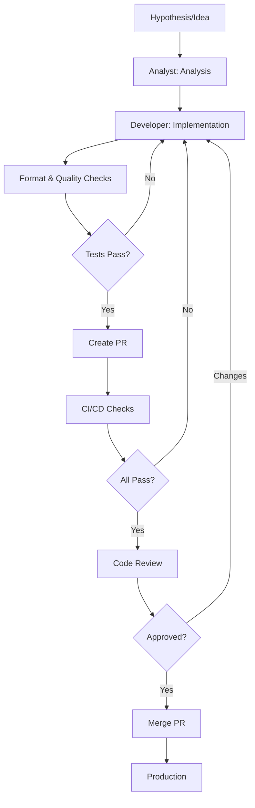
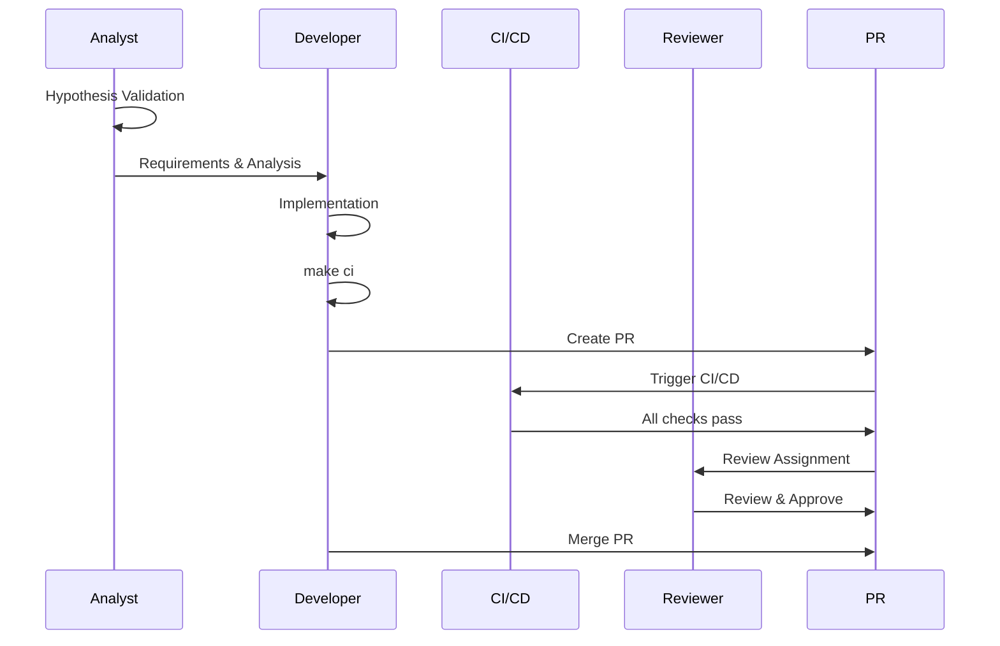

# Software Development Life Cycle (SDLC)

Vibe Coding SDLC emphasizes quality at every phase with strict quality gates and minimal suppressions.

## Overview



## Phases

### Phase 0: Hypothesis & Analysis

**Role: Analyst**

**Objectives:**
- Validate hypothesis
- Define requirements
- Plan implementation approach

**Activities:**
- Document hypothesis
- Technical analysis
- Quality planning
- Test scenarios

**Commands:**
```bash
make setup          # Setup project
make analyze-full   # Check quality baseline
make coverage       # View coverage
```

**Deliverables:**
- Requirements document
- Technical analysis
- Architecture proposal
- Quality plan

### Phase 1: Development Preparation

**Role: Developer**

**Activities:**
```bash
git checkout -b feat/scope-description
make setup
make analyze-full
```

**Quality Gates:**
- Project compiles without errors
- All existing tests pass
- Quality baseline established

### Phase 2: Implementation

**Role: Developer**

**Activities:**
- Write production-ready code
- Follow project conventions
- Apply SOLID principles

**Quality Gates:**
- Code compiles without warnings
- Formatting passes (`make format-check`)
- Quality checks pass (`make analyze-full`)
- Tests pass (`make test`)
- Coverage thresholds met (`make coverage`)

**Commands:**
```bash
make format         # Format code frequently
make analyze-full   # Check quality after changes
make test          # Run tests during development
make coverage      # Check coverage
```

### Phase 3: Pre-PR Validation

**Role: Developer**

**Activities:**
```bash
make ci            # Full CI pipeline
./scripts/create-pr.sh  # Auto-generate PR
```

**Quality Gates:**
- All local checks pass
- Branch name follows convention
- Commit messages follow convention

### Phase 4: Code Review

**Role: Reviewer**

**Review Process:**
1. Automatic checks (CI/CD): Format, quality, tests, security
2. Manual review: Code quality, Vibe Coding compliance, tests, documentation
3. Reviewer assignment: CODEOWNERS or manual by Team Lead
4. Actions: Approve, Request Changes, or Comment

**Reviewer Commands:**
```bash
gh pr checkout <number>  # Checkout PR locally
make analyze-full        # Verify quality
make test               # Run tests
```

**Checklist:**
- [ ] Code follows conventions
- [ ] No unnecessary suppressions
- [ ] Suppressions documented
- [ ] Tests comprehensive
- [ ] Coverage thresholds met

### Phase 5: Merge & Integration

**Role: Developer**

**Activities:**
```bash
gh pr merge <pr-number> --squash
```

**Quality Gates:**
- All CI/CD jobs pass
- Integration tests pass
- No regressions
- Quality metrics maintained

## Quality Gates

### Development Phase

| Gate | Tool | Threshold | Command |
|------|------|-----------|---------|
| Formatting | Spotless | Must pass | `make format-check` |
| Checkstyle | Checkstyle | `maxWarnings=0` | `make analyze-full` |
| PMD | PMD | `ignoreFailures=false` | `make analyze-full` |
| SpotBugs | SpotBugs | `ignoreFailures=false` | `make analyze-full` |
| SonarLint | SonarLint | `ignoreFailures=false` | `make analyze-full` |

### Testing Phase

| Gate | Tool | Threshold | Command |
|------|------|-----------|---------|
| Unit Tests | JUnit 5 | All pass | `make test` |
| Coverage (Instructions) | JaCoCo | ≥85% | `make coverage` |
| Coverage (Branches) | JaCoCo | ≥75% | `make coverage` |
| Coverage (Lines) | JaCoCo | ≥90% | `make coverage` |

### Code Review Phase

| Gate | Tool | Threshold | Location |
|------|------|-----------|----------|
| CI/CD Pipeline | GitHub Actions | All jobs pass | `.github/workflows/ci.yml` |
| SonarCloud | SonarCloud | Must pass | SonarCloud dashboard |
| Security Scan | OWASP, Trivy | No critical issues | CI/CD pipeline |

## Workflow



## Roles

### Analyst
- Validate hypothesis
- Define requirements
- Technical analysis
- **Commands**: `make setup`, `make analyze-full`, `make coverage`

### Developer
- Implement features
- Write tests
- Maintain quality
- **Commands**: `make format`, `make analyze-full`, `make test`, `make ci`

### Reviewer
- Review code
- Verify quality
- Approve PRs
- **Commands**: `gh pr checkout`, `make analyze-full`, `make test`

### Team Lead
- Manage PRs
- Assign reviewers
- Ensure quality
- **Commands**: `gh pr list`, `gh pr edit`, `gh pr review`

## Best Practices

### During Development
1. Run quality checks frequently: `make analyze-full`
2. Fix issues immediately
3. Maintain coverage: Write tests alongside code

### Before Committing
1. Format code: `make format`
2. Run quality checks: `make analyze-full`
3. Run tests: `make test`

### Before PR
1. All quality gates pass
2. Coverage thresholds met
3. No new suppressions (or documented)
4. Documentation updated

## References

- [Quick Start Guide](../QUICK_START.md)
- [Quality Gates](../quality/QUALITY_GATES.md)
- [CI/CD Pipeline](../quality/CI_CD.md)
- [Roles Guide](../ROLES.md)
